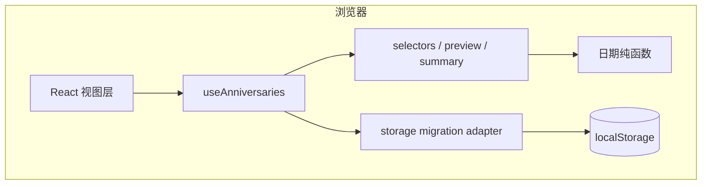
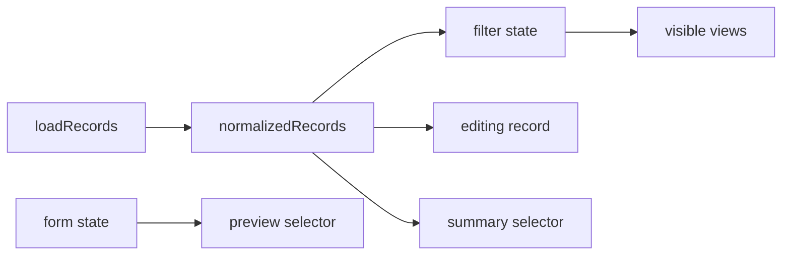

# 系统架构文档

## 文档信息
- **功能名称**：daymark-organize-preview-summary
- **版本**：1.0
- **创建日期**：2026-03-29
- **作者**：Architect Agent

## 摘要

- **架构模式**：继续保持前端单体 Web SPA，本地优先，不引入后端和云端依赖。
- **技术栈**：React 19 + TypeScript + Vite + 原生 CSS；`localStorage` 从 V1 容器平滑迁移到兼容 V2 容器。
- **核心设计决策**：新增字段只扩持久化最小原始数据；筛选、即时预览、首页摘要都收敛为派生视图，不写回存储。
- **主要风险**：旧数据迁移、筛选状态和排序规则交叉、摘要区再次信息膨胀。
- **项目结构**：沿用 `app / features / components / lib / storage` 分层，在 `features/anniversaries` 集中处理筛选状态、摘要选择器和预览选择器。

---

## 1. 架构概述

### 1.1 系统架构图



### 1.2 架构决策

| 决策 | 选项 | 选择 | 原因 |
|------|------|------|------|
| 数据演进 | 原地扩字段 / 新容器版本 / 单独迁移脚本 | 新容器版本 + 运行时迁移 | 旧数据已存在，版本化容器能保证兼容和回滚边界清晰。 |
| 分类方案 | 完全自定义 / 固定枚举 / 标签数组 | 固定单值枚举 | 这是个人纪念册，不值得引入复杂分类系统。 |
| 归档标记 | `isArchived` 布尔值 / `archivedAtISO` 时间戳 | `archivedAtISO: string | null` | 既能表达状态，又保留审计信息，恢复时可直接置空。 |
| 筛选状态 | 组件局部 state / Hook 集中管理 / 独立状态库 | Hook 集中管理 | 当前仍是单页局部状态，不需要额外状态库。 |
| 预览实现 | 组件里直接计算 / selectors 派生 / 存入 state | selectors 派生 | 预览和摘要一样，本质都是对表单输入的临时派生，不应污染持久化数据。 |

### 1.3 Linus 三问结论

1. **这是个真问题，不是臆想需求**：当记录变多时，默认排序不能替代筛选；删除也不能替代归档。
2. **有更简单的方法吗**：有。补两个最小字段和一层派生逻辑，比上搜索、后台、同步简单得多。
3. **会破坏什么吗**：会，若直接改存储结构且不做迁移就会破坏既有本地数据；所以迁移必须是第一原则。

---

## 2. 技术栈

| 层级 | 技术 | 版本 | 说明 |
|------|------|------|------|
| 前端框架 | React | 19.x | 继续承载单页交互和派生展示。 |
| 构建工具 | Vite | 7.x | 维持现有开发和构建方式。 |
| 语言 | TypeScript | 5.x | 用类型收紧新增分类、归档和摘要结构。 |
| 样式 | 原生 CSS | - | 在现有样式系统上扩展摘要、筛选条和预览区。 |
| 测试 | Vitest + RTL + Playwright | 3.x / 16.x / 1.54+ | 补齐迁移、筛选、归档、预览和摘要测试。 |
| 数据持久化 | localStorage | 浏览器内建 | 继续本地优先，升级到版本化兼容容器。 |

---

## 3. 目录结构

```
daymark/
├── src/
│   ├── app/
│   │   ├── App.tsx
│   │   └── index.css
│   ├── components/
│   │   ├── anniversary/
│   │   │   ├── AnniversaryForm.tsx
│   │   │   ├── AnniversaryList.tsx
│   │   │   ├── AnniversaryCard.tsx
│   │   │   ├── AnniversarySummary.tsx
│   │   │   ├── AnniversaryPreview.tsx      # 新增：表单即时预览
│   │   │   └── AnniversaryFilters.tsx      # 新增：分类/状态筛选
│   │   └── common/
│   │       ├── Button.tsx
│   │       ├── DateField.tsx
│   │       ├── TextField.tsx
│   │       └── SelectField.tsx             # 可选新增：分类选择
│   ├── features/
│   │   └── anniversaries/
│   │       ├── types.ts
│   │       ├── selectors.ts
│   │       ├── categories.ts               # 新增：分类常量与文案
│   │       └── useAnniversaries.ts
│   ├── storage/
│   │   └── anniversaryStorage.ts
│   ├── lib/date/
│   │   ├── normalize.ts
│   │   ├── anniversary.ts
│   │   └── format.ts
│   └── tests/
│       ├── unit/
│       └── integration/
└── tests/e2e/
```

### 3.1 分层约束

- `types.ts` 只定义原始实体、筛选状态和摘要视图契约，不夹带组件逻辑。
- `categories.ts` 负责固定分类元数据，避免到处散落硬编码字符串。
- `selectors.ts` 统一处理视图转换、筛选、摘要生成和预览生成。
- `storage/*` 只负责读写和迁移，不负责排序、筛选或摘要。
- `components/*` 不直接读写存储，也不自行重算摘要和筛选。

---

## 4. 数据模型

### 4.1 持久化实体

```ts
export type AnniversaryCategory =
  | 'relationship'
  | 'family'
  | 'career'
  | 'pet'
  | 'life'
  | 'other'
  | 'uncategorized';

export interface AnniversaryRecordV2 {
  id: string;
  title: string;
  baseDateISO: string;
  category: AnniversaryCategory;
  archivedAtISO: string | null;
  createdAtISO: string;
  updatedAtISO: string;
}
```

### 4.2 兼容容器

```ts
export interface AnniversaryStoreV1 {
  version: 1;
  records: Array<{
    id: string;
    title: string;
    baseDateISO: string;
    createdAtISO: string;
    updatedAtISO: string;
  }>;
}

export interface AnniversaryStoreV2 {
  version: 2;
  records: AnniversaryRecordV2[];
}
```

### 4.3 迁移策略

`loadRecords()` 读取存储时遵循：

1. 如果是 `version: 2`，直接校验并读取。
2. 如果是 `version: 1`，逐条迁移为：
   - `category = 'uncategorized'`
   - `archivedAtISO = null`
3. 如果 JSON 损坏或结构错误，回退为空数组。
4. `saveRecords()` 从本次迭代开始统一写回 `version: 2`。

这个策略满足两个目标：

- 旧用户不需要手工迁移；
- 新结构有清晰版本边界，后续还能继续演进。

### 4.4 筛选与表单状态

```ts
export type ArchiveFilter = 'active' | 'archived' | 'all';

export interface AnniversaryFilterState {
  archive: ArchiveFilter;
  category: AnniversaryCategory | 'all';
}

export interface AnniversaryFormInput {
  title: string;
  baseDateISO: string;
  category: AnniversaryCategory;
}
```

### 4.5 视图模型

```ts
export interface AnniversaryView extends AnniversaryMetrics {
  id: string;
  title: string;
  baseDateISO: string;
  category: AnniversaryCategory;
  archivedAtISO: string | null;
  createdAtISO: string;
  updatedAtISO: string;
  formattedBaseDate: string;
  elapsedLabel: string;
  countdownLabel: string;
  anniversaryLabel: string;
  highlightLevel: 'today' | 'soon' | 'normal';
}

export interface AnniversaryPreviewView {
  ready: boolean;
  title: string;
  categoryLabel: string;
  elapsedLabel: string;
  countdownLabel: string;
  relationshipLabel: string;
}

export interface AnniversarySummaryView {
  heroTitle: string;
  heroMessage: string;
  spotlightRecord: AnniversaryView | null;
  activeCount: number;
  archivedCount: number;
  upcoming30Count: number;
  categoryBreakdown: Array<{
    category: AnniversaryCategory;
    label: string;
    count: number;
  }>;
}
```

### 4.6 为什么不存派生值

以下内容全部运行时派生，不进入存储：

- 筛选后的列表
- 表单即时预览
- 首页摘要块
- 近 30 天临近数量
- 分类分布

原因不变：这些值都会随着当前日期、筛选条件和输入状态改变，存下来只会腐烂。

---

## 5. 选择器与状态流

### 5.1 核心派生函数

建议在 `selectors.ts` 中新增或重构为以下函数：

```ts
declare function normalizeRecord(record: AnniversaryRecord | AnniversaryRecordV2): AnniversaryRecordV2;
declare function selectAnniversaryViews(records: AnniversaryRecordV2[], filter: AnniversaryFilterState, todayISO?: string): AnniversaryView[];
declare function buildAnniversaryPreview(input: AnniversaryFormInput, todayISO?: string): AnniversaryPreviewView | null;
declare function buildAnniversarySummary(allRecords: AnniversaryRecordV2[], activeViews: AnniversaryView[]): AnniversarySummaryView;
```

### 5.2 状态流



### 5.3 `useAnniversaries` 责任扩展

Hook 继续作为唯一状态入口，但新增以下状态：

- `filterState`
- `setArchiveFilter`
- `setCategoryFilter`
- `toggleArchive`
- `preview`

仍然维持一个原则：新增和编辑共用一条提交流程，归档和恢复共用一个状态切换入口。

---

## 6. 组件架构

### 6.1 `AnniversaryForm`

新增职责：

- 增加分类字段
- 暴露当前 `formState`
- 在表单下方展示 `AnniversaryPreview`

不新增职责：

- 不直接做日期计算
- 不自己决定分类筛选

### 6.2 `AnniversaryList`

新增职责：

- 在列表标题区上方或同层承载 `AnniversaryFilters`
- 根据当前视图决定空状态文案，例如“当前筛选下暂无记录”

### 6.3 `AnniversaryCard`

新增职责：

- 展示分类徽标
- 提供“归档 / 恢复”按钮

删除不建议的职责：

- 不在卡片内自己决定是否显示该卡片

### 6.4 `AnniversarySummary`

重做目标：

- 放弃把“当前时间 / 日期 / 农历”作为主信息区
- 主区突出 `spotlightRecord`
- 次级区突出 `activeCount / archivedCount / upcoming30Count`
- 分类分布只展示前几类，不做复杂图表

---

## 7. 存储与兼容设计

### 7.1 读取路径

```ts
function loadRecords(storage?: Storage): AnniversaryRecordV2[] {
  // parse -> detect version -> migrate if needed -> normalize defaults
}
```

### 7.2 写入路径

```ts
function saveRecords(records: AnniversaryRecordV2[], storage?: Storage): void {
  // always save as version 2
}
```

### 7.3 兼容默认值

| 字段 | 旧数据缺失时默认值 | 理由 |
|------|------------------|------|
| `category` | `uncategorized` | 避免旧数据在筛选中“消失” |
| `archivedAtISO` | `null` | 旧记录默认仍是活跃内容 |

---

## 8. 测试策略

### 8.1 单元测试

- V1 存储迁移到 V2
- 缺失新增字段时默认值正确
- 分类筛选和归档筛选组合正确
- 即时预览在合法和非法输入下输出正确
- 新摘要选择器在不同数据分布下输出正确

### 8.2 集成测试

- 创建时选择分类后卡片和筛选联动
- 归档后记录从活跃列表消失并出现在归档视图
- 编辑态即时预览实时更新
- 首页摘要对活跃/归档/近期即将到来条目反映准确

### 8.3 E2E

- 创建带分类的纪念日并筛选查看
- 归档与恢复完整闭环
- 输入过程中即时预览可见
- 刷新后分类和归档状态仍保留

---

## 9. 风险与取舍

| 风险 | 可能性 | 影响 | 缓解措施 |
|------|--------|------|----------|
| 迁移逻辑把旧数据误判为空 | 中 | 高 | 单独测试 V1/V2 分支，禁止只写 happy path。 |
| 筛选状态和排序规则互相打架 | 中 | 中 | 先筛选后排序，规则固定写进 selector。 |
| 摘要区再次堆信息 | 高 | 中 | 只保留 1 个聚焦主卡 + 2 至 3 个关键指标。 |
| 分类枚举后续不够用 | 中 | 低 | 预留 `other` 和 `uncategorized`，把自定义体系延后。 |

### 9.1 为什么这是好品味

- 特殊情况被收敛到迁移层和选择器层，没有散在 UI 分支里。
- 归档没有引入第二套数据源，只是活跃视图上的状态过滤。
- 预览和摘要都是纯派生，不让存储层背锅。

---

## 变更记录

| 版本 | 日期 | 作者 | 变更内容 |
|------|------|------|----------|
| 1.0 | 2026-03-29 | Architect Agent | 规划 V1.1 的分类/筛选/归档、即时预览和首页摘要重构架构。 |
