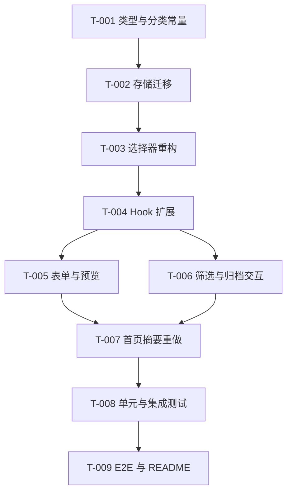

# 开发任务规格文档

## 文档信息
- **功能名称**：daymark-organize-preview-summary
- **版本**：1.1
- **创建日期**：2026-03-29
- **作者**：Scrum Master Agent
- **关联故事**：`.boss/daymark-organize-preview-summary/prd.md`

## 摘要

- **任务总数**：9 个任务
- **前端任务**：9 个
- **后端任务**：0 个
- **关键路径**：T-001 类型与分类常量 -> T-002 存储迁移 -> T-003 选择器重构 -> T-004 Hook 扩展 -> T-005/T-006/T-007 UI 改造 -> T-008/T-009 测试与文档
- **预估复杂度**：中

---

## 0. 已确认边界

- 本期只做 `分类 / 筛选 / 归档`、`表单即时预览`、`首页摘要重做`。
- 继续保持前端单体 SPA，本地优先，无后端、无登录、无云同步。
- 未来日期仍不支持。
- 分类采用固定枚举，不做自定义分类管理。
- 旧版 `version: 1` 本地数据必须自动兼容，不允许要求用户清空存储。
- 列表排序规则不变：筛选后仍按“距离下一次周年最近”排序。

---

## 1. 任务概览

### 1.1 统计信息

| 指标 | 数量 |
|------|------|
| 总任务数 | 9 |
| 创建文件 | 4 |
| 修改文件 | 13 |
| 测试文件 | 6 |

### 1.2 任务分布

| 复杂度 | 数量 |
|--------|------|
| 低 | 2 |
| 中 | 6 |
| 高 | 1 |

### 1.3 故事映射

| Story | 对应任务 |
|------|----------|
| US-001：按类别查找纪念日 | T-001, T-002, T-003, T-004, T-006, T-008, T-009 |
| US-002：把不常看的记录收起来 | T-002, T-003, T-004, T-006, T-008, T-009 |
| US-003：提交前确认结果 | T-003, T-004, T-005, T-008, T-009 |
| US-004：首页先看到重点 | T-003, T-004, T-007, T-008, T-009 |

---

## 2. 任务详情

### Story: S-001 - 扩展数据结构并保持兼容

#### Task T-001：定义分类枚举、筛选状态和 V2 领域类型

**类型**：修改 / 创建

**目标文件**：

| 文件路径 | 操作 | 说明 |
|----------|------|------|
| `src/features/anniversaries/types.ts` | 修改 | 扩展 `AnniversaryRecord`、新增 `AnniversaryCategory`、`AnniversaryFilterState`、`AnniversaryPreviewView` |
| `src/features/anniversaries/categories.ts` | 创建 | 维护固定分类枚举、展示文案和默认顺序 |
| `src/tests/factories.ts` | 修改 | 为测试工厂补分类和归档默认值 |

**实现步骤**：

1. 为领域实体补最小新增字段：
   - `category`
   - `archivedAtISO`
2. 定义固定分类枚举，至少包含 `uncategorized`。
3. 新增筛选状态类型和预览/摘要视图契约。
4. 更新测试工厂默认值，避免每个测试单独补字段。

**测试用例**：

文件：`src/tests/unit/selectors.spec.ts`

| 用例 ID | 描述 | 类型 |
|---------|------|------|
| TC-001-1 | 默认工厂创建的记录带 `uncategorized` 和活跃状态 | 单元测试 |
| TC-001-2 | 分类常量输出顺序和文案稳定 | 单元测试 |

**复杂度**：低

**依赖**：无

**注意事项**：
- 新字段必须是原始字段，不要把标签颜色、筛选状态写进实体。
- 枚举值和显示文案分离，避免未来重命名破坏存储值。

---

#### Task T-002：升级本地存储到 V2 并兼容 V1 数据迁移

**类型**：修改

**目标文件**：

| 文件路径 | 操作 | 说明 |
|----------|------|------|
| `src/storage/anniversaryStorage.ts` | 修改 | 支持 `version: 1` 和 `version: 2` 容器，迁移旧记录 |
| `src/tests/unit/anniversaryStorage.spec.ts` | 修改 | 增加迁移、默认值和 V2 写回测试 |

**实现步骤**：

1. 新增 `AnniversaryStoreV2` 类型守卫。
2. 在 `loadRecords()` 中识别 V1 和 V2：
   - V1 自动补 `category: 'uncategorized'`
   - V1 自动补 `archivedAtISO: null`
3. `saveRecords()` 一律写回 `version: 2`。
4. 维持损坏 JSON 回退为空数组的兜底逻辑。

**测试用例**：

文件：`src/tests/unit/anniversaryStorage.spec.ts`

| 用例 ID | 描述 | 类型 |
|---------|------|------|
| TC-002-1 | 读取 V1 数据时自动补默认分类和活跃状态 | 单元测试 |
| TC-002-2 | 保存时统一输出 V2 容器 | 单元测试 |
| TC-002-3 | 读取 V2 数据能正确回读新增字段 | 单元测试 |
| TC-002-4 | 结构错误时继续回退为空数组 | 单元测试 |

**复杂度**：中

**依赖**：T-001

**注意事项**：
- 迁移逻辑只放存储层，不要把兼容判断散落到 UI。
- 不要改现有 storage key，版本放在容器里处理即可。

---

### Story: S-002 - 收敛派生逻辑与页面状态

#### Task T-003：重构选择器，统一视图、筛选、预览和摘要派生

**类型**：修改

**目标文件**：

| 文件路径 | 操作 | 说明 |
|----------|------|------|
| `src/features/anniversaries/selectors.ts` | 修改 | 新增分类标签、筛选函数、预览派生、摘要聚合 |
| `src/features/anniversaries/types.ts` | 修改 | 对齐新的 summary / preview 结构 |
| `src/tests/unit/selectors.spec.ts` | 修改 | 补筛选、预览、摘要聚合测试 |

**实现步骤**：

1. 保留 `toAnniversaryView()` 作为单条记录统一入口。
2. 新增 `filterAnniversaryViews()` 或等价函数，固定规则为“先过滤，再排序”。
3. 新增 `buildAnniversaryPreview()`，复用现有日期纯函数和格式化函数。
4. 重写 `buildAnniversarySummary()`，输出聚焦记录、活跃数、归档数、30 天内临近数、分类分布。

**测试用例**：

文件：`src/tests/unit/selectors.spec.ts`

| 用例 ID | 描述 | 类型 |
|---------|------|------|
| TC-003-1 | 活跃 / 已归档 / 全部筛选正确 | 单元测试 |
| TC-003-2 | 分类筛选不破坏默认排序 | 单元测试 |
| TC-003-3 | 合法输入能生成即时预览视图 | 单元测试 |
| TC-003-4 | 非法输入不生成成功态预览 | 单元测试 |
| TC-003-5 | 摘要优先聚焦今天或近期条目 | 单元测试 |

**复杂度**：高

**依赖**：T-001, T-002

**注意事项**：
- 选择器不要长成一个巨函数，按“列表 / 预览 / 摘要”拆分。
- 组件层禁止再做分类计数或近 30 天统计。

---

#### Task T-004：扩展 `useAnniversaries`，集中管理筛选、归档与预览状态

**类型**：修改

**目标文件**：

| 文件路径 | 操作 | 说明 |
|----------|------|------|
| `src/features/anniversaries/useAnniversaries.ts` | 修改 | 新增筛选状态、归档/恢复动作、预览派生和新摘要接线 |
| `src/tests/integration/app.spec.tsx` | 修改 | 验证状态入口驱动的页面更新 |

**实现步骤**：

1. 在 Hook 中新增 `filterState`。
2. 新增动作：
   - `setArchiveFilter`
   - `setCategoryFilter`
   - `archiveRecord`
   - `restoreRecord`
3. `submitRecord()` 支持写入分类字段。
4. 通过 `useMemo` 暴露：
   - `views`
   - `summary`
   - `preview`

**测试用例**：

文件：`src/tests/integration/app.spec.tsx`

| 用例 ID | 描述 | 类型 |
|---------|------|------|
| TC-004-1 | 默认进入活跃视图 | 集成测试 |
| TC-004-2 | 切换筛选后列表与摘要同步更新 | 集成测试 |
| TC-004-3 | 归档后活跃列表减少、归档视图可见 | 集成测试 |

**复杂度**：中

**依赖**：T-003

**注意事项**：
- 编辑态取消时不能重置筛选状态。
- 归档和恢复是状态切换，不走删除确认流程。

---

### Story: S-003 - 补齐表单、筛选和摘要交互

#### Task T-005：为表单增加分类输入与即时预览工作区

**类型**：创建 / 修改

**目标文件**：

| 文件路径 | 操作 | 说明 |
|----------|------|------|
| `src/components/common/SelectField.tsx` | 创建 | 轻量原生选择组件，服务分类字段 |
| `src/components/anniversary/AnniversaryPreview.tsx` | 创建 | 即时预览卡组件 |
| `src/components/anniversary/AnniversaryForm.tsx` | 修改 | 增加分类字段和预览插槽 |
| `src/tests/integration/anniversaryForm.spec.tsx` | 修改 | 补分类输入和预览交互测试 |

**实现步骤**：

1. 用原生 `<select>` 封装 `SelectField`，与现有输入组件风格一致。
2. `AnniversaryForm` 增加分类字段，默认值为 `uncategorized`。
3. 把 `preview` 放在字段组和按钮之间，形成连续录入体验。
4. 非法输入时只显示错误，不渲染成功态预览。

**测试用例**：

文件：`src/tests/integration/anniversaryForm.spec.tsx`

| 用例 ID | 描述 | 类型 |
|---------|------|------|
| TC-005-1 | 选择分类后保存成功并写入卡片 | 集成测试 |
| TC-005-2 | 合法输入时即时预览出现 | 集成测试 |
| TC-005-3 | 非法输入时不显示成功态预览 | 集成测试 |
| TC-005-4 | 编辑态修改日期时预览同步变化 | 集成测试 |

**复杂度**：中

**依赖**：T-004

**注意事项**：
- 不要把预览做成第二张正式卡片，语义上它是“草稿预演”。
- 预览逻辑来自 selector，不要在组件里重复算天数。

---

#### Task T-006：新增筛选条，并为卡片补归档/恢复交互

**类型**：创建 / 修改

**目标文件**：

| 文件路径 | 操作 | 说明 |
|----------|------|------|
| `src/components/anniversary/AnniversaryFilters.tsx` | 创建 | scope 切换和分类芯片 |
| `src/components/anniversary/AnniversaryList.tsx` | 修改 | 接入筛选条和筛选无结果空态 |
| `src/components/anniversary/AnniversaryCard.tsx` | 修改 | 展示分类标签、归档/恢复按钮 |
| `src/tests/integration/anniversaryList.spec.tsx` | 修改 | 补筛选、归档与恢复测试 |

**实现步骤**：

1. 在列表头增加筛选条，包含：
   - `活跃`
   - `已归档`
   - `全部`
   - 分类芯片
2. 卡片新增分类标签。
3. 活跃卡片显示 `归档`，归档卡片显示 `恢复`。
4. 区分“全局无记录空态”和“筛选无结果空态”。

**测试用例**：

文件：`src/tests/integration/anniversaryList.spec.tsx`

| 用例 ID | 描述 | 类型 |
|---------|------|------|
| TC-006-1 | 按分类筛选后只显示目标分类记录 | 集成测试 |
| TC-006-2 | 归档后记录从活跃视图消失 | 集成测试 |
| TC-006-3 | 在已归档视图中可恢复记录 | 集成测试 |
| TC-006-4 | 筛选无结果时展示专用空态 | 集成测试 |

**复杂度**：中

**依赖**：T-004

**注意事项**：
- 归档不是危险操作，不要复用删除确认弹窗。
- 删除仍要保留，且语义必须和归档分开。

---

#### Task T-007：重做首页摘要与页面排版

**类型**：修改

**目标文件**：

| 文件路径 | 操作 | 说明 |
|----------|------|------|
| `src/components/anniversary/AnniversarySummary.tsx` | 修改 | 改为聚焦主卡 + 关键概览卡 |
| `src/app/App.tsx` | 修改 | 调整摘要、表单、筛选、列表的组装顺序 |
| `src/app/index.css` | 修改 | 增加筛选条、预览区、摘要新布局样式 |
| `src/tests/integration/app.spec.tsx` | 修改 | 校验新的摘要信息优先级 |

**实现步骤**：

1. 摘要主视觉只聚焦一个当前重点条目。
2. 用 2-3 个指标卡展示：
   - 活跃记录数
   - 已归档记录数
   - 30 天内临近数量
3. 当前时间 / 日期 / 农历降级为次级信息或移出主视觉。
4. 让摘要在筛选变化时能感知当前上下文，但不丢全局健康度信息。

**测试用例**：

文件：`src/tests/integration/app.spec.tsx`

| 用例 ID | 描述 | 类型 |
|---------|------|------|
| TC-007-1 | 摘要展示近期焦点纪念日 | 集成测试 |
| TC-007-2 | 摘要展示活跃/归档/近期提醒指标 | 集成测试 |
| TC-007-3 | 筛选变化后摘要上下文文案更新 | 集成测试 |

**复杂度**：中

**依赖**：T-004, T-005, T-006

**注意事项**：
- 不要把摘要改成信息墓地。
- 设计优先级必须围绕“现在最该看什么”。

---

### Story: S-004 - 把质量门禁补齐

#### Task T-008：补齐单元与集成测试，锁死迁移和交互边界

**类型**：修改

**目标文件**：

| 文件路径 | 操作 | 说明 |
|----------|------|------|
| `src/tests/unit/anniversaryStorage.spec.ts` | 修改 | 补迁移和 V2 读写 |
| `src/tests/unit/selectors.spec.ts` | 修改 | 补筛选、预览、摘要 |
| `src/tests/integration/anniversaryForm.spec.tsx` | 修改 | 补分类和预览 |
| `src/tests/integration/anniversaryList.spec.tsx` | 修改 | 补归档、恢复、筛选空态 |
| `src/tests/integration/app.spec.tsx` | 修改 | 补摘要断言 |

**实现步骤**：

1. 先补迁移和 selector 测试，再补 UI 集成测试。
2. 断言语义结果，避免过度依赖 class 或宽松文本。
3. 固定测试日期，避免跨天引发脆弱失败。

**测试用例**：

文件：`src/tests/unit/*.spec.ts` 与 `src/tests/integration/*.spec.tsx`

| 用例 ID | 描述 | 类型 |
|---------|------|------|
| TC-008-1 | V1 数据迁移到 V2 后结果正确 | 单元测试 |
| TC-008-2 | 分类筛选、归档筛选与排序组合正确 | 单元测试 |
| TC-008-3 | 即时预览合法/非法状态切换正确 | 集成测试 |
| TC-008-4 | 首页摘要在筛选和数据变化后稳定更新 | 集成测试 |

**复杂度**：中

**依赖**：T-002, T-003, T-004, T-005, T-006, T-007

**注意事项**：
- 没有迁移测试，这个迭代视为未完成。
- 不要把集成测试写成 UI 快照堆砌。

---

#### Task T-009：补齐 E2E 流程与 README 迭代说明

**类型**：修改

**目标文件**：

| 文件路径 | 操作 | 说明 |
|----------|------|------|
| `tests/e2e/anniversary.spec.ts` | 修改 | 增加分类、筛选、归档/恢复、预览和摘要 E2E |
| `README.md` | 修改 | 更新 V1.1 能力与边界说明 |
| `playwright.config.ts` | 修改（按需） | 如有必要，稳定 webServer 启动配置 |

**实现步骤**：

1. 在固定测试日期下新增以下真实流程：
   - 创建带分类的记录
   - 通过分类筛选命中记录
   - 归档并在归档视图中恢复
   - 录入时看到即时预览
   - 摘要反映近期重点
2. 在 README 中更新当前功能边界和新增管理能力。
3. 若 Playwright 启动仍不稳定，优先修配置和等待策略。

**测试用例**：

文件：`tests/e2e/anniversary.spec.ts`

| 用例 ID | 描述 | 类型 |
|---------|------|------|
| TC-009-1 | 新建带分类的记录后可被对应筛选命中 | E2E |
| TC-009-2 | 归档后记录移出活跃并可在归档视图恢复 | E2E |
| TC-009-3 | 录入时即时预览可见且随输入变化 | E2E |
| TC-009-4 | 首页摘要展示近期重点和关键指标 | E2E |

**复杂度**：低

**依赖**：T-008

**注意事项**：
- E2E 继续用真实表单交互，不直接操作 `localStorage` 绕过 UI。
- README 只更新真实已实现的能力，别提前写未来规划。

---

## 3. 实现前检查清单

- [ ] 已阅读 `.boss/daymark-organize-preview-summary/prd.md`
- [ ] 已阅读 `.boss/daymark-organize-preview-summary/architecture.md`
- [ ] 已阅读 `.boss/daymark-organize-preview-summary/ui-spec.md`
- [ ] 已确认固定分类枚举和默认值策略
- [ ] 已确认旧数据兼容规则：`uncategorized + archivedAtISO = null`
- [ ] 已准备固定测试日期方案
- [ ] 已确认当前 E2E webServer 启动问题是否需要顺手修复

---

## 4. 任务依赖图

---

## 5. 文件变更汇总

### 5.1 新建文件

| 文件路径 | 关联任务 | 说明 |
|----------|----------|------|
| `src/features/anniversaries/categories.ts` | T-001 | 分类常量与文案 |
| `src/components/common/SelectField.tsx` | T-005 | 分类选择组件 |
| `src/components/anniversary/AnniversaryPreview.tsx` | T-005 | 表单即时预览 |
| `src/components/anniversary/AnniversaryFilters.tsx` | T-006 | 列表筛选条 |

### 5.2 修改文件

| 文件路径 | 关联任务 | 变更类型 |
|----------|----------|----------|
| `src/features/anniversaries/types.ts` | T-001, T-003 | 类型扩展 |
| `src/storage/anniversaryStorage.ts` | T-002 | V2 迁移与读写 |
| `src/features/anniversaries/selectors.ts` | T-003 | 筛选/预览/摘要派生 |
| `src/features/anniversaries/useAnniversaries.ts` | T-004 | 状态和动作扩展 |
| `src/components/anniversary/AnniversaryForm.tsx` | T-005 | 分类输入与预览接线 |
| `src/components/anniversary/AnniversaryList.tsx` | T-006 | 筛选条与空态 |
| `src/components/anniversary/AnniversaryCard.tsx` | T-006 | 分类标签、归档/恢复按钮 |
| `src/components/anniversary/AnniversarySummary.tsx` | T-007 | 摘要重构 |
| `src/app/App.tsx` | T-007 | 页面组装调整 |
| `src/app/index.css` | T-007 | 样式扩展 |
| `README.md` | T-009 | 功能边界更新 |
| `playwright.config.ts` | T-009 | 按需稳定 E2E 启动 |

### 5.3 测试文件

| 文件路径 | 关联任务 | 测试类型 |
|----------|----------|----------|
| `src/tests/unit/anniversaryStorage.spec.ts` | T-002, T-008 | 单元测试 |
| `src/tests/unit/selectors.spec.ts` | T-003, T-008 | 单元测试 |
| `src/tests/integration/anniversaryForm.spec.tsx` | T-005, T-008 | 集成测试 |
| `src/tests/integration/anniversaryList.spec.tsx` | T-006, T-008 | 集成测试 |
| `src/tests/integration/app.spec.tsx` | T-004, T-007, T-008 | 集成测试 |
| `tests/e2e/anniversary.spec.ts` | T-009 | E2E |

---

## 6. 代码规范提醒

### TypeScript

- 固定枚举和显示文案分离
- 迁移函数显式命名，避免隐式补字段
- 避免把筛选状态混进持久化实体

### React

- 组件只做渲染和事件转发
- 预览和摘要都从 Hook / selector 消费
- 归档、恢复、筛选动作都统一走 `useAnniversaries`

### 测试

- 先补迁移测试，再做 UI
- 先断言业务结果，再关心展示细节
- E2E 不允许绕过 UI

---

## 变更记录

| 版本 | 日期 | 作者 | 变更内容 |
|------|------|------|----------|
| 1.0 | 2026-03-29 | Scrum Master Agent | 拆解 Daymark V1.1 的分类/筛选/归档、即时预览与首页摘要重做任务。 |
