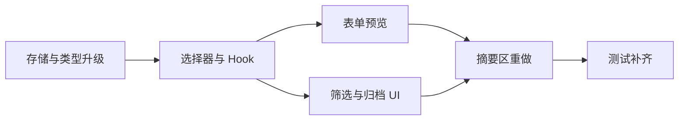

# 技术方案评审报告

## 摘要

- **评审结论**：⚠️ 有条件通过
- **主要风险**：`v1 -> v2` 存储迁移、摘要与筛选口径不一致、预览与正式卡片逻辑分叉
- **必须解决**：先锁定 `version: 2` 数据结构、摘要选择器口径和归档动作出口，再开始 UI 实现
- **建议优化**：分类保持固定枚举，筛选状态不持久化，归档视图继续沿用默认排序
- **技术债务**：未来若做自定义分类或云同步，需要再抽象；本期不该提前设计

## 1. 评审概述

- **项目名称**：daymark-organize-preview-summary
- **评审日期**：2026-03-29
- **评审人**：Tech Lead Agent
- **评审文档**：
  - PRD：`.boss/daymark-organize-preview-summary/prd.md`
  - 架构：`.boss/daymark-organize-preview-summary/architecture.md`
  - UI 规范：`.boss/daymark-organize-preview-summary/ui-spec.md`

## 2. 评审结论

| 维度 | 评分 | 说明 |
|------|------|------|
| 架构合理性 | ⭐⭐⭐⭐⭐ | 继续维持前端单体和现有分层是正确路线，没有为了本地数据问题引入后端。 |
| 技术选型 | ⭐⭐⭐⭐⭐ | React state + selector + `localStorage` 足够解决本期问题，不需要新库。 |
| 可扩展性 | ⭐⭐⭐⭐☆ | `v2` 结构为后续扩展留了口，但固定分类仍是刻意约束，不是通用平台。 |
| 可维护性 | ⭐⭐⭐⭐☆ | 只要摘要、列表、预览都走统一派生链路，可维护性会明显好于组件内拼逻辑。 |
| 安全性 | ⭐⭐⭐⭐☆ | 本地应用安全面有限，主要风险仍是脏数据解析和危险操作反馈。 |

**总体评价**：⚠️ 有条件通过。  
问题是真的，方案也值得做，但前提是别把“分类 + 归档 + 摘要”分别实现成三套互不相认的状态机。

## 3. 技术风险评估

| 风险 | 等级 | 影响范围 | 缓解措施 |
|------|------|----------|----------|
| 旧数据迁移不完整，导致现有记录读不出来 | 高 | 存储、列表、编辑、测试 | 存储层集中支持 `v1` 读取并转换到 `v2` |
| 摘要统计与筛选结果口径不一致 | 高 | 首页信息可信度 | 摘要统一消费 `buildSummarySnapshot()` 输出 |
| 预览单独实现后与正式卡片文案不一致 | 高 | 表单体验、用户信任 | 预览直接复用 `toAnniversaryView()` |
| 归档状态散落在组件层，恢复 / 删除相互打架 | 中 | 卡片动作、焦点管理、测试 | 继续由 `useAnniversaries.ts` 统一提供动作 |
| 三个新交互入口让页面过于拥挤 | 中 | 桌面端和移动端体验 | 用筛选条 + 轻量预览 + 精简摘要控制信息量 |

## 4. 技术可行性分析

### 4.1 核心功能可行性

| 功能 | 可行性 | 复杂度 | 说明 |
|------|--------|--------|------|
| 固定分类与筛选 | ✅ 可行 | M | 主要工作在数据结构补字段和筛选状态建模。 |
| 归档与恢复 | ✅ 可行 | M | 本质是记录状态切换，不需要新页面或新存储容器。 |
| 表单即时预览 | ✅ 可行 | S | 当前纯函数已经够用，只需构造草稿记录复用。 |
| 首页摘要重做 | ✅ 可行 | M | 关键不是 UI，而是先统一摘要派生口径。 |
| 兼容旧数据迁移 | ✅ 可行 | M | 存储层已版本化，继续扩展即可。 |

### 4.2 技术难点

| 难点 | 解决方案 | 预估工时 |
|------|----------|----------|
| `v1 -> v2` 迁移与容错 | 在 `anniversaryStorage.ts` 中集中做类型守卫和映射 | 0.5 天 |
| 列表、摘要、预览三套视图口径统一 | 抽统一 selector 和 summary snapshot | 0.5 天 |
| 归档 / 恢复动作与删除确认并存 | 继续收口到 `useAnniversaries.ts` 的动作层 | 0.25 天 |
| 测试面扩张 | 先补单元和集成，再更新 E2E | 0.5 天 |

## 5. 架构改进建议

### 5.1 必须修改（阻塞项）

- [ ] **先定义 `version: 2` 存储模型**：不先定结构就开改 UI，后面一定返工。
- [ ] **先统一摘要口径**：必须明确摘要基于当前筛选上下文，而不是组件各自拼数据。
- [ ] **预览复用正式计算链路**：不能另写一套“差不多”的草稿算法。

### 5.2 建议优化（非阻塞）

- [ ] **分类固定为 5 到 6 类**：别把本期变成“标签管理系统”。
- [ ] **筛选状态不持久化**：本地偏好不值得写存储。
- [ ] **归档视图继续沿用默认排序**：不要再引入第二种排序规则。

## 6. 实施建议

### 6.1 开发顺序建议



### 6.2 里程碑建议

| 里程碑 | 内容 | 建议工时 | 风险等级 |
|--------|------|----------|----------|
| M1 | 类型、存储迁移、分类常量、基础选择器 | 0.5 天 | 中 |
| M2 | Hook、筛选、归档、预览、摘要 UI | 1 天 | 中 |
| M3 | 单元 / 集成 / E2E / 回归修正 | 0.5 天 | 中 |

### 6.3 技术债务预警

| 潜在债务 | 产生原因 | 建议处理时机 |
|----------|----------|--------------|
| 固定分类难以满足个性化需求 | 本期故意压 scope | 真实用户明确提出后再做 |
| 本地存储无法跨设备同步 | 继续无后端 | 将来若验证出真实需求再讨论 |
| 摘要指标继续扩张 | 产品想法容易膨胀 | 每次迭代都先问“这个指标到底帮了谁” |

## 7. 代码规范建议

### 7.1 目录结构规范

```text
src/
├── app/
├── components/
│   ├── anniversary/
│   └── common/
├── features/anniversaries/
├── lib/date/
├── storage/
└── tests/
```

### 7.2 命名规范

- **文件命名**：分类常量放 `categories.ts` 或 `constants.ts`，摘要派生优先复用 `selectors.ts`，只有过大才拆 `summaries.ts`
- **组件命名**：新组件使用业务语义命名，如 `AnniversaryFilters`、`AnniversaryPreview`
- **函数命名**：动作函数用动词，如 `archiveRecord`、`restoreRecord`
- **变量命名**：原始记录 `record`，派生卡片 `view`，摘要快照 `summarySnapshot`

### 7.3 代码风格

- 领域事实进入存储，界面上下文只留在 Hook
- 超过 3 层缩进就重构派生链路，不要堆条件
- 组件只消费 view model，不直接解释原始数据

## 8. 评审结论

- **是否通过**：⚠️ 有条件通过
- **阻塞问题数**：3 个
- **建议优化数**：3 个
- **下一步行动**：按“存储升级 -> 选择器 -> Hook -> UI -> 测试”的顺序拆任务，不要直接从 CSS 开始。
