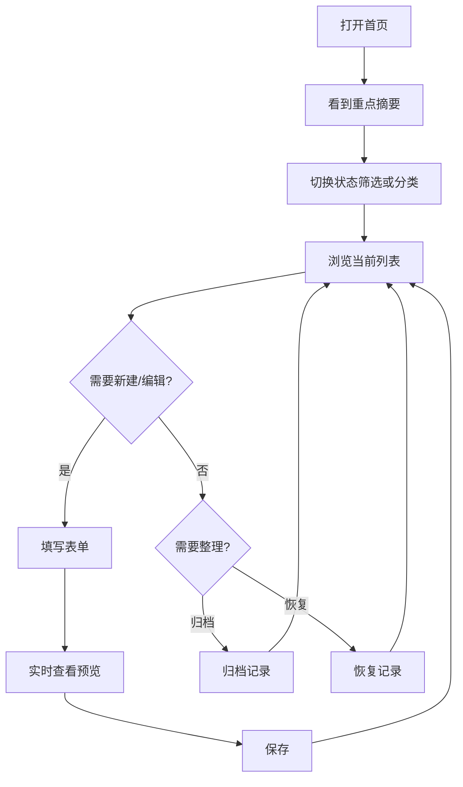

# UI/UX 规范文档

## 摘要

- **设计风格**：延续温暖纪念册气质，但把首屏重心从“时间氛围”改成“当前该关注什么”。
- **主色调**：保留米白、墨灰、铜金、松绿体系，通过分类色点和归档弱化态扩展视觉层级。
- **核心组件**：重点摘要卡、分类与状态筛选条、表单即时预览卡、支持归档 / 恢复的纪念日卡片。
- **响应式断点**：继续使用移动端单列、桌面端左右分栏，但筛选条和预览区要在小屏更靠前。
- **设计系统**：沿用现有 CSS 变量和组件风格，不引入重量级 UI 框架，不新增复杂导航。

## 文档信息
- **功能名称**：daymark-organize-preview-summary
- **版本**：1.1
- **创建日期**：2026-03-29
- **作者**：UI Designer Agent

---

## 1. 设计概述

### 1.1 设计理念

让首页从“展示现在几点”转成“展示现在该看什么”。  
这次改动不是换皮，而是把用户注意力重新排序：

1. 先看当前筛选上下文下最值得关注的纪念日。
2. 再看分类、状态和数量关系。
3. 最后才进入表单和列表维护。

### 1.2 设计原则

- **简洁**：分类固定、筛选入口固定，不做多层配置。
- **一致**：摘要、筛选、列表、预览都围绕同一份纪念日卡片语言展开。
- **可访问**：筛选、归档、恢复必须可键盘访问，状态变化要有可读文案。
- **响应式**：移动端先看摘要和筛选，再看表单和列表；桌面端保留双栏效率。

---

## 2. 用户流程

### 2.1 主流程



### 2.2 流程说明

| 步骤 | 页面/组件 | 用户行为 | 系统响应 |
|------|-----------|----------|----------|
| 1 | 首页摘要区 | 打开首页 | 直接显示当前筛选上下文下的重点卡和支持指标 |
| 2 | 筛选条 | 切换分类或状态 | 列表和摘要同时刷新 |
| 3 | 表单区 | 输入名称、日期、分类 | 下方即时显示草稿预览或占位说明 |
| 4 | 纪念日卡片 | 点击归档 / 恢复 / 删除 | Toast 反馈，列表即时更新 |
| 5 | 归档视图 | 查看已归档记录 | 可恢复，也可删除 |

---

## 3. 设计令牌

### 3.1 颜色系统

#### 主色调
| 名称 | 色值 | 用途 |
|------|------|------|
| Primary | `#B77945` | 重点按钮、主摘要强调 |
| Primary Light | `#D7A476` | 主卡渐变过渡、悬停态 |
| Primary Dark | `#8E5930` | 按下态与重点边框 |

#### 语义色
| 名称 | 色值 | 用途 |
|------|------|------|
| Success | `#5B7C67` | 保存、恢复成功 |
| Warning | `#D19A3C` | 30 天内将到来的提示 |
| Error | `#B44C43` | 删除与错误提示 |
| Archive | `#7E7A73` | 已归档的弱化态标签 |

#### 分类辅助色
| 分类 | 色值 | 用途 |
|------|------|------|
| 关系 | `#B77945` | 分类标签与点缀线 |
| 家庭 | `#B44C43` | 分类标签 |
| 工作 | `#52718F` | 分类标签 |
| 宠物 | `#6E8B5E` | 分类标签 |
| 生活 | `#5B7C67` | 分类标签 |
| 其他 | `#8A7F74` | 分类标签 |
| 未分类 | `#AAA094` | 默认迁移标签与弱提示 |

### 3.2 排版系统

| 名称 | 大小 | 行高 | 字重 | 用途 |
|------|------|------|------|------|
| H1 | 32px | 1.15 | 700 | 首页主标题 |
| H2 | 24px | 1.25 | 650 | 区块标题 |
| H3 | 18px | 1.35 | 600 | 卡片标题 |
| Metric | 28px | 1.1 | 700 | 重点数字 |
| Body | 16px | 1.6 | 400 | 正文 |
| Small | 14px | 1.5 | 400 | 辅助信息 |
| Caption | 12px | 1.4 | 500 | 标签与筛选说明 |

### 3.3 间距与圆角

继续沿用现有 spacing / rounded 体系，不新增第二套标准。  
新增规则：

- 筛选条内部使用 `spacing-2 ~ spacing-3`
- 预览卡与表单字段间距使用 `spacing-4`
- 主摘要卡与支持指标卡之间使用 `spacing-5 ~ spacing-6`

---

## 4. 页面规范

### 4.1 首页新结构

```text
+------------------------------------------------------+
| 顶部重点摘要：当前焦点 + 当前筛选概览                  |
+------------------------------------------------------+
| 表单区（左）                         筛选 + 列表（右） |
| - 名称 / 日期 / 分类                                  |
| - 即时预览卡                                          |
+------------------------------------------------------+
```

### 4.2 摘要区重做

#### 新结构

- 一张主卡：当前最值得关注的记录
- 两到三张支持卡：
  - 当前可见记录数
  - 活跃 / 归档数量关系
  - 30 天内将到来的数量或最长纪念时长

#### 信息优先级

1. 当前筛选条件下的 `spotlight`
2. 当前用户正在看的集合规模
3. 全局活跃 / 归档关系
4. 近期变化信息

#### 删除项

- 不再把“当前时间 / 当前日期 / 农历”作为摘要核心块展示。
- 这类信息若保留，只能退居次要位置，不占主视觉。

### 4.3 筛选条

#### 结构

- 第一层：状态切换 `活跃 / 已归档 / 全部`
- 第二层：分类筛选 `全部分类 + 关系 / 家庭 / 工作 / 宠物 / 生活 / 其他 / 未分类`

#### 交互规则

- 状态切换优先级高于分类切换，始终在上方。
- 当前激活项采用实底或描边强化，不能只靠颜色变化。
- 筛选结果为 0 时显示“无结果空状态”，而不是空白列表。

### 4.4 表单即时预览

#### 位置

- 桌面端：放在表单字段下方、操作按钮上方
- 移动端：放在日期字段之后，尽量保证无需滚动太远就能看见

#### 内容

- 预览标题
- 分类标签
- 原始日期
- 已过去天数
- 距离下一次周年
- 周年说明文案

#### 占位规则

- 名称或日期未填完整：显示温和占位文案
- 日期非法或未来日期：显示错误态预览占位，不显示伪结果
- 编辑态：预览与当前正在编辑的记录实时同步

### 4.5 卡片操作区

#### 活跃记录

- 主操作：编辑
- 次操作：归档
- 危险操作：删除

#### 已归档记录

- 主操作：恢复
- 危险操作：删除

#### 视觉弱化

- 已归档卡片整体降低对比度
- 增加“已归档”标签
- 仍保留名称和日期信息，避免看起来像被删除

---

## 5. 组件规范

### 5.1 筛选组件 AnniversaryFilters

#### 组成

- 状态分段控件
- 分类胶囊组或下拉控件
- 结果数量提示

#### 状态
| 状态 | 变化 |
|------|------|
| Default | 纸白底 + 轻边框 |
| Active | 铜金或分类色强调 |
| Hover | 亮度提升 4% |
| Focus | 2px 清晰焦点环 |

### 5.2 即时预览组件 AnniversaryPreview

#### 形式

- 视觉语言尽量接近正式卡片，但弱化操作区
- 左上角显示“草稿预览”标记
- 不提供编辑、归档、删除按钮

### 5.3 摘要组件 AnniversarySummary

#### 主卡内容

- 当前标题
- 当前重点说明文案
- 重点日期或倒计时
- 当前筛选上下文说明

#### 支持指标卡

- 数量必须少，最多 3 张
- 每张只表达 1 个指标，不做墓碑式信息堆砌

### 5.4 空状态

#### 无记录

- 沿用现有“创建第一条纪念日”引导

#### 筛选无结果

- 标题示例：`这一组里还没有纪念日`
- 提示：建议切换分类、切回活跃、或新建一条
- 提供按钮：`清空筛选`

#### 归档空状态

- 标题示例：`你还没有归档任何日子`
- 提示：当有些记录暂时不想出现在主列表时，可以先归档

---

## 6. 动效规范

### 6.1 关键动效

- 筛选切换：内容透明度轻过渡，不做横向剧烈滑动
- 预览出现：淡入 + 上移 8px，时长 220ms
- 归档 / 恢复：卡片透明度与位置轻微过渡，时长 220ms
- 摘要刷新：数字和文案做轻淡入，不做翻牌特效

### 6.2 原则

- 动效必须帮助理解状态变化，不负责“显得高级”。
- 归档和恢复属于内容组织变化，反馈要明确但克制。

---

## 7. 无障碍要求

### 7.1 键盘导航

- 筛选条所有项支持 Tab 访问
- 状态切换建议使用语义化按钮组
- 归档 / 恢复 / 删除按钮的焦点顺序与视觉顺序一致

### 7.2 屏幕阅读器

- 分类标签需要读出具体名称
- 归档状态需要有文字，不只靠颜色灰化
- 预览区需要明确读出“草稿预览”

### 7.3 触控目标

- 筛选项与卡片操作按钮最小触控区域不小于 `44x44px`

---

## 变更记录

| 版本 | 日期 | 作者 | 变更内容 |
|------|------|------|----------|
| 1.1 | 2026-03-29 | UI Designer Agent | 规划 V1.1 的筛选条、即时预览、首页摘要重做与归档交互规范 |
