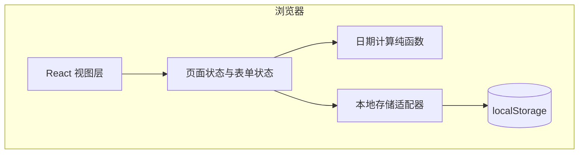
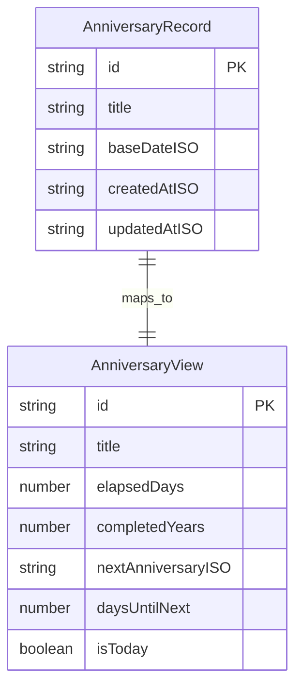
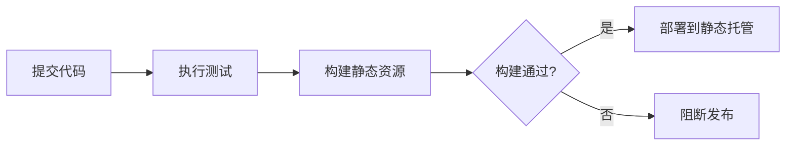

# 系统架构文档

## 文档信息
- **功能名称**：daymark
- **版本**：1.0
- **创建日期**：2026-03-27
- **作者**：Architect Agent

## 摘要

- **架构模式**：前端单体 Web SPA，本地优先，不引入后端和远端数据库。
- **技术栈**：Vite + React + TypeScript + 原生 CSS 变量；数据持久化使用 `localStorage`。
- **核心设计决策**：只存原始纪念日数据，不存“过去天数”“倒计时”等衍生值；所有时间结果在运行时由纯函数计算。
- **主要风险**：日期边界处理容易出错，尤其是时区、闰年和 2 月 29 日周年规则；通过统一日期归一化和单元测试兜底。
- **项目结构**：按 `app / features / components / lib / storage` 拆分，避免把日期算法、存储和 UI 糊在一起。

---

## 1. 架构概述

### 1.1 系统架构图



### 1.2 架构决策

| 决策 | 选项 | 选择 | 原因 |
|------|------|------|------|
| 前端框架 | React / Vue / 原生 DOM | React | 这个项目有表单、列表、编辑态、衍生视图，组件化比手写 DOM 更稳，复杂度也没高到需要更重的方案。 |
| 构建工具 | Vite / Webpack / 无构建 | Vite | 启动快，配置少，适合新仓库和小型 SPA。 |
| 持久化 | localStorage / IndexedDB / 后端数据库 | localStorage | 数据量极小，结构简单，读写频率低，不值得引入 IndexedDB 或服务端。 |
| 状态管理 | React state / Zustand / Redux | React state + 自定义 Hook | 状态只在单页内流动，没有跨页复杂共享，不需要额外状态库。 |
| 日期处理 | Day.js / date-fns / 原生 Date + 纯函数 | 原生 Date + 纯函数封装 | 需求只涉及日粒度计算，自己封装少量纯函数更可控，也减少依赖。 |

### 1.3 架构结论

这是个真问题，不是臆想需求：用户确实需要记录纪念日并看到经过天数与下次周年倒计时。  
更简单的方法也明确：单页前端 + 本地存储已经够用，引入后端、账号体系、同步服务都属于过度设计。  
这是新仓库，不存在兼容旧系统的问题；但要避免以后破坏本地数据，因此本地存储键名和数据版本必须一开始就定下来。

---

## 2. 技术栈

| 层级 | 技术 | 版本 | 说明 |
|------|------|------|------|
| 前端框架 | React | 19.x | 负责组件化渲染、表单交互和派生视图。 |
| 构建工具 | Vite | 7.x | 提供开发服务器和生产构建。 |
| 语言 | TypeScript | 5.x | 限定数据结构，减少日期与存储字段出错。 |
| 样式 | 原生 CSS + CSS 变量 | - | 不引入 UI 框架，保持视觉自由度和体积可控。 |
| 测试 | Vitest + React Testing Library | 3.x / 16.x | 单元测试覆盖日期算法，组件测试覆盖 CRUD 和关键文案。 |
| 数据持久化 | localStorage | 浏览器内建 | 保存纪念日列表，支持本地离线使用。 |

---

## 3. 目录结构

```
daymark/
├── src/
│   ├── app/
│   │   ├── App.tsx                 # 页面壳层
│   │   └── index.css               # 全局视觉变量与布局
│   ├── components/
│   │   ├── common/                 # 按钮、输入框、空状态等通用组件
│   │   └── anniversary/            # 纪念日卡片、统计面板、表单
│   ├── features/
│   │   └── anniversaries/
│   │       ├── useAnniversaries.ts # 列表读写和表单动作
│   │       ├── selectors.ts        # 基于原始数据生成 UI 视图模型
│   │       └── types.ts            # 领域类型
│   ├── lib/
│   │   └── date/
│   │       ├── normalize.ts        # 日期归一化
│   │       ├── anniversary.ts      # 周年和倒计时算法
│   │       └── format.ts           # 文案格式化
│   ├── storage/
│   │   └── anniversaryStorage.ts   # localStorage 适配器
│   ├── tests/
│   │   ├── unit/
│   │   │   └── anniversary.spec.ts
│   │   └── integration/
│   │       └── app.spec.tsx
│   ├── main.tsx
│   └── vite-env.d.ts
├── index.html
├── package.json
├── tsconfig.json
└── README.md
```

### 3.1 分层约束

- `features/anniversaries/types.ts` 只定义原始实体，不夹带 UI 字段。
- `lib/date/*` 只做纯函数计算，不读写浏览器对象。
- `storage/*` 只负责序列化和版本迁移，不做业务判断。
- `components/*` 不直接操作 `localStorage`，所有写操作统一通过 Hook 或 actions 进入。

这样拆的目的只有一个：让“算法”“存储”“界面”三件事彼此隔离，后面任何一块改动都能单独审计和回滚。

---

## 4. 数据模型

### 4.1 实体关系图



### 4.2 数据字典

#### 表：AnniversaryRecord（本地持久化实体）

| 字段 | 类型 | 必填 | 默认值 | 说明 |
|------|------|------|--------|------|
| id | string | 是 | `crypto.randomUUID()` | 记录主键。 |
| title | string | 是 | - | 纪念日名称，如“第一次见面”。 |
| baseDateISO | string | 是 | - | 原始日期，统一保存为 `YYYY-MM-DD`。 |
| createdAtISO | string | 是 | 当前时间 | 创建时间，用于排序和审计。 |
| updatedAtISO | string | 是 | 当前时间 | 最近修改时间。 |

#### 本地存储容器

```ts
type AnniversaryStoreV1 = {
  version: 1;
  records: AnniversaryRecord[];
};
```

本地存储键名固定为：`daymark.records.v1`

### 4.3 为什么不存衍生值

下面这些值全部实时计算，不写入存储：

- `elapsedDays`：已经过去多少天
- `completedYears`：已经过了多少个周年
- `nextAnniversaryISO`：下一个周年日期
- `daysUntilNext`：距离下一个周年还有多少天
- `isToday`：今天是否正好是纪念日

理由很简单：

1. 这些值都可以由 `baseDateISO + today` 推导出来。
2. 一旦把衍生值也存下来，明天打开页面就会过期，数据天然腐烂。
3. 派生值缓存带来的那点性能收益，在这个量级完全不值得。

---

## 5. 时间计算与内部契约

### 5.1 计算规则

#### 日期归一化

- 所有输入日期先转成 `YYYY-MM-DD`。
- 所有日差计算都按“本地日历日”处理，不按毫秒差直接除以 86400000。
- 计算前统一把日期归一到本地中午 12:00，降低 DST 夏令时切换导致的跨日误差。

#### 已过去天数

```ts
elapsedDays = diffCalendarDays(today, baseDate)
```

说明：
- 当 `baseDate` 是今天，结果为 `0`
- 不允许未来日期进入该分支；表单校验直接阻止

#### 下一个周年

算法思路：

1. 从 `baseDate` 取出月和日。
2. 用当前年份组装候选周年日期。
3. 如果候选日期早于今天，则切到下一年。
4. 2 月 29 日使用固定策略：平年按 2 月 28 日计算。

#### 周年数

```ts
completedYears = nextAnniversaryYear - baseYear - 1
```

若今天正好是周年日，则：

- `completedYears = today.year - baseYear`
- `daysUntilNext = 0`

### 5.2 内部模块接口

虽然没有后端 API，但模块之间仍然要有稳定契约。

#### Storage 接口

```ts
interface AnniversaryStorage {
  load(): AnniversaryStoreV1;
  save(store: AnniversaryStoreV1): void;
}
```

#### Domain 接口

```ts
type AnniversaryMetrics = {
  elapsedDays: number;
  completedYears: number;
  nextAnniversaryISO: string;
  daysUntilNext: number;
  isToday: boolean;
};

declare function calculateAnniversaryMetrics(
  baseDateISO: string,
  todayISO?: string
): AnniversaryMetrics;
```

#### Feature Selector

```ts
type AnniversaryCardViewModel = AnniversaryRecord & AnniversaryMetrics;

declare function buildAnniversaryView(records: AnniversaryRecord[]): AnniversaryCardViewModel[];
```

### 5.3 排序策略

MVP 默认支持三种视图排序：

| 方式 | 规则 | 用途 |
|------|------|------|
| 最近到来 | `daysUntilNext` 升序 | 默认首页 |
| 最近创建 | `createdAtISO` 降序 | 查找新记录 |
| 最久以前 | `elapsedDays` 降序 | 回顾历史感强的纪念日 |

排序结果同样只在前端视图层派生，不回写原始数据。

---

## 6. 安全与稳定性设计

### 6.1 输入安全

- 标题输入做长度限制，建议 1 到 40 字。
- 去除首尾空白，空字符串不允许提交。
- 日期必须是合法过去日期，禁止未来日期。
- React 默认转义文本，避免把标题内容直接插入 HTML。

### 6.2 数据稳定性

- 读取 `localStorage` 时做 JSON 解析保护，脏数据回退为空列表。
- 存储结构带 `version`，后续需要迁移时可兼容旧数据。
- 所有写操作先生成完整新数组，再一次性覆盖保存，避免半写状态。

### 6.3 兼容性策略

- 首版目标浏览器：现代 Chromium、Safari、Firefox。
- 不依赖服务器时间，全部以用户本机日期为准。
- 若浏览器禁用 `localStorage`，页面降级为只读空态并给出提示。

---

## 7. 部署与运行方式

### 7.1 环境

| 环境 | 用途 | URL | 说明 |
|------|------|-----|------|
| 开发 | 本地开发 | `http://localhost:5173` | Vite 默认开发环境 |
| 预览 | 构建产物预览 | 本地静态服务 | 验证打包结果 |
| 生产 | 静态托管 | 待定 | 可部署到 GitHub Pages、Vercel 或 Netlify |

### 7.2 部署流程



这个项目本质是静态站点，部署成本应接近零。  
如果首版就上容器、数据库、CI 编排，那不是架构能力，是控制不住手。

---

## 8. 测试策略

### 8.1 单元测试

覆盖纯函数与边界场景：

- 同一天返回 `elapsedDays = 0`
- 普通日期跨年后的周年计算
- 闰年日期到平年的周年计算
- 当前日期晚于周年与早于周年两种分支
- 存储读到脏 JSON 时的回退逻辑

### 8.2 组件/集成测试

覆盖用户真实动作：

- 新增一条纪念日后卡片正确渲染
- 编辑标题或日期后卡片文案同步更新
- 删除记录后列表更新且存储同步
- 列表空状态、非法输入错误状态展示正确
- 默认排序按 `daysUntilNext` 生效

### 8.3 手工冒烟测试

- 桌面和移动宽度布局是否稳定
- 刷新页面后本地数据是否保留
- 系统日期变化后衍生数据是否自然更新

---

## 9. 风险与取舍

| 风险 | 可能性 | 影响 | 缓解措施 |
|------|--------|------|----------|
| 日期差计算受时区/DST 影响 | 中 | 高 | 统一日历日计算，不按毫秒直接换算；补齐单元测试。 |
| 2 月 29 日周年规则引发用户预期差异 | 低 | 中 | 首版明确采用“平年按 2 月 28 日”并在文案中说明。 |
| `localStorage` 数据被用户手动改坏 | 中 | 中 | 读取时做 schema 容错和回退。 |
| 不做云同步导致跨设备不可用 | 高 | 低 | 明确列为 MVP 范围外，不用错误方案解决真问题之外的需求。 |

### 9.1 为什么这套方案值得做

- 真问题：用户要的是“记住日子”和“知道还剩多久”，不是账号系统。
- 更简单：单页前端已经足够，不把简单需求做成分布式系统。
- 不破坏兼容性：新仓库无历史包袱；本地数据通过版本键名留出未来演进空间。

---

## 变更记录

| 版本 | 日期 | 作者 | 变更内容 |
|------|------|------|----------|
| 1.0 | 2026-03-27 | Architect Agent | 初始版本，确定前端单体、本地存储与日期纯函数架构。 |
