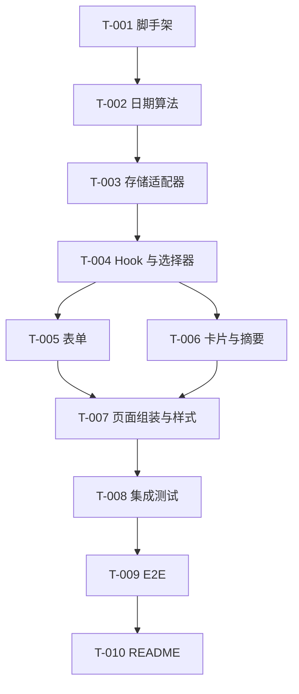

# 开发任务规格文档

## 文档信息
- **功能名称**：daymark
- **版本**：1.0
- **创建日期**：2026-03-27
- **作者**：Scrum Master Agent
- **关联文档**：
  - `C:\code\virtue\daymark\.boss\daymark\prd.md`
  - `C:\code\virtue\daymark\.boss\daymark\architecture.md`
  - `C:\code\virtue\daymark\.boss\daymark\ui-spec.md`
  - `C:\code\virtue\daymark\.boss\daymark\tech-review.md`

## 摘要

- **任务总数**：10 个
- **前端任务**：10 个
- **后端任务**：0 个
- **关键路径**：T-001 脚手架 -> T-002 日期算法 -> T-003 本地存储 -> T-004 状态与派生视图 -> T-005/T-006 UI -> T-008/T-009 测试
- **预估复杂度**：中

---

## 0. 已确认边界

- MVP 只支持 `名称 + 日期` 两个输入字段。
- 未来日期不允许提交，表单直接阻止。
- 列表固定按“距离下一次周年最近”排序，不做手动排序切换。
- 纪念日条目只持久化原始数据，不持久化派生结果。
- E2E 必须覆盖新增、编辑、删除、列表展示、纪念日计算 5 条核心流程。
- UI 文档中出现的 `备注` 字段和手动排序交互，本期不实现。

---

## 1. 任务概览

### 1.1 统计信息

| 指标 | 数量 |
|------|------|
| 总任务数 | 10 |
| 创建文件 | 24 |
| 修改文件 | 0 |
| 测试文件 | 5 |

### 1.2 任务分布

| 复杂度 | 数量 |
|--------|------|
| 低 | 3 |
| 中 | 6 |
| 高 | 1 |

### 1.3 故事映射

| Story | 对应任务 |
|------|----------|
| US-001：快速记录纪念日 | T-001, T-003, T-004, T-005, T-007, T-008, T-009 |
| US-002：查看下一个周年倒计时 | T-002, T-004, T-006, T-007, T-008, T-009 |
| US-003：维护已有记录 | T-003, T-004, T-005, T-006, T-008, T-009 |

---

## 2. 任务详情

### Story: S-001 - 搭建可运行的前端仓库

#### Task T-001：初始化仓库脚手架与开发配置

**类型**：创建

**目标文件**：

| 文件路径 | 操作 | 说明 |
|----------|------|------|
| `package.json` | 创建 | 定义 React、Vite、TypeScript、Vitest、Playwright 依赖与脚本 |
| `tsconfig.json` | 创建 | 启用严格模式 |
| `tsconfig.node.json` | 创建 | 供 Vite / Playwright 配置使用 |
| `vite.config.ts` | 创建 | 基础构建配置 |
| `vitest.config.ts` | 创建 | 测试环境与覆盖率阈值 |
| `playwright.config.ts` | 创建 | E2E 配置 |
| `.gitignore` | 创建 | 忽略 `node_modules`、`dist`、测试产物 |
| `index.html` | 创建 | 应用入口 |
| `src/main.tsx` | 创建 | React 挂载入口 |
| `src/vite-env.d.ts` | 创建 | Vite 类型声明 |

**实现步骤**：

1. 建立最小前端仓库，不引入状态库和 UI 框架。
2. 在 `package.json` 中定义至少以下脚本：
   ```json
   {
     "scripts": {
       "dev": "vite",
       "build": "tsc -b && vite build",
       "preview": "vite preview",
       "test": "vitest run --coverage",
       "test:watch": "vitest",
       "test:integration": "vitest run src/tests/integration",
       "test:e2e": "playwright test"
     }
   }
   ```
3. 测试环境使用 `jsdom`，E2E 使用 Playwright。
4. 入口只负责挂载 `App`，不要把业务逻辑塞进 `main.tsx`。

**测试用例**：

文件：`src/tests/integration/bootstrap.spec.tsx`

| 用例 ID | 描述 | 类型 |
|---------|------|------|
| TC-001-1 | 应用入口可成功渲染根节点 | 集成测试 |
| TC-001-2 | `npm run build` 所需配置齐全 | 冒烟测试 |

**复杂度**：低

**依赖**：无

**注意事项**：

- 不要一上来接 ESLint/Prettier 全家桶之外的装饰依赖。
- Playwright 和 Vitest 配置要分开，别混在一个配置文件里。
- 覆盖率阈值在配置中直接写死，避免 QA 阶段口头约束。

---

### Story: S-002 - 固化数据结构与日期算法

#### Task T-002：实现领域类型与日期纯函数

**类型**：创建

**目标文件**：

| 文件路径 | 操作 | 说明 |
|----------|------|------|
| `src/features/anniversaries/types.ts` | 创建 | 定义 `AnniversaryRecord`、`AnniversaryStoreV1`、视图类型 |
| `src/lib/date/normalize.ts` | 创建 | 统一 `YYYY-MM-DD` 解析与本地日归一化 |
| `src/lib/date/anniversary.ts` | 创建 | 计算已过去天数、周年数、下次周年、剩余天数 |
| `src/lib/date/format.ts` | 创建 | 将算法结果转成页面文案 |
| `src/tests/unit/anniversary.spec.ts` | 创建 | 日期算法单元测试 |

**实现步骤**：

1. 在 `types.ts` 里只保留原始持久化实体：
   ```ts
   export interface AnniversaryRecord {
     id: string;
     title: string;
     baseDateISO: string;
     createdAtISO: string;
     updatedAtISO: string;
   }
   ```
2. 日期计算函数显式接收 `todayISO` 可选参数，消除测试对系统时钟的依赖。
3. 统一本地日历日计算，不能直接用毫秒差除以 `86400000`。
4. 明确 2 月 29 日在平年按 2 月 28 日计算周年。
5. `format.ts` 只负责文案，不参与业务判断。

**测试用例**：

文件：`src/tests/unit/anniversary.spec.ts`

| 用例 ID | 描述 | 类型 |
|---------|------|------|
| TC-002-1 | 同一天返回 `elapsedDays = 0` 且 `daysUntilNext = 0` | 单元测试 |
| TC-002-2 | 当前日期早于当年周年时，返回当年周年倒计时 | 单元测试 |
| TC-002-3 | 当前日期晚于当年周年时，切换到下一年周年 | 单元测试 |
| TC-002-4 | 2 月 29 日在平年按 2 月 28 日计算周年 | 单元测试 |
| TC-002-5 | 格式化文案能正确输出“就是今天”状态 | 单元测试 |

**复杂度**：中

**依赖**：T-001

**注意事项**：

- 这是核心业务，任何特殊情况都要收敛在纯函数里，不能散在 UI 组件里。
- 未来日期不允许进入算法主路径；若收到未来日期，返回明确错误或让上游校验拦截。
- 文案与计算分层，别把中文字符串写死在算法函数里。

---

#### Task T-003：实现本地存储适配器与容错

**类型**：创建

**目标文件**：

| 文件路径 | 操作 | 说明 |
|----------|------|------|
| `src/storage/anniversaryStorage.ts` | 创建 | `localStorage` 读写、schema 校验、回退策略 |
| `src/tests/unit/anniversaryStorage.spec.ts` | 创建 | 存储读写与脏数据容错测试 |

**实现步骤**：

1. 固定存储键名为 `daymark.records.v1`。
2. 提供 `loadRecords()`、`saveRecords()`、`clearRecords()` 之类的窄接口。
3. 加入最小运行时校验，保证读到脏 JSON 时回退空列表而不是崩溃。
4. 只做序列化和容器版本管理，不做排序和业务逻辑。

**测试用例**：

文件：`src/tests/unit/anniversaryStorage.spec.ts`

| 用例 ID | 描述 | 类型 |
|---------|------|------|
| TC-003-1 | 保存后能正确读回记录列表 | 单元测试 |
| TC-003-2 | 读到损坏 JSON 时返回空列表 | 单元测试 |
| TC-003-3 | 读到错误版本结构时返回空列表 | 单元测试 |
| TC-003-4 | 保存时不会写入派生字段 | 单元测试 |

**复杂度**：中

**依赖**：T-002

**注意事项**：

- 不要引入重量级 schema 库；手写类型守卫够了。
- 存储层不能知道“下次周年还有几天”这类派生值。
- 回退策略必须可预测，禁止 silent corruption。

---

### Story: S-003 - 建立状态入口与派生视图

#### Task T-004：实现列表状态 Hook 与视图选择器

**类型**：创建

**目标文件**：

| 文件路径 | 操作 | 说明 |
|----------|------|------|
| `src/features/anniversaries/selectors.ts` | 创建 | 基于原始记录生成卡片视图模型和默认排序 |
| `src/features/anniversaries/useAnniversaries.ts` | 创建 | 封装新增、编辑、删除、加载、错误、Toast 状态 |
| `src/tests/unit/selectors.spec.ts` | 创建 | 默认排序与视图派生测试 |

**实现步骤**：

1. `selectors.ts` 中统一做两件事：
   - 调用日期纯函数生成派生视图
   - 按 `daysUntilNext` 升序排序，若相同则按 `createdAtISO` 升序兜底
2. `useAnniversaries.ts` 负责把存储、表单行为、当前编辑态串起来。
3. 删除流程保留 `confirmingDeleteId` 或等价状态，不要把确认框状态散落多个组件。
4. Hook 返回窄接口，例如 `records`, `submitRecord`, `startEdit`, `cancelEdit`, `confirmDelete`。

**测试用例**：

文件：`src/tests/unit/selectors.spec.ts`

| 用例 ID | 描述 | 类型 |
|---------|------|------|
| TC-004-1 | 记录默认按最近周年倒计时排序 | 单元测试 |
| TC-004-2 | 倒计时相同时按创建时间稳定排序 | 单元测试 |
| TC-004-3 | 进入编辑态时能正确回填目标记录 | 单元测试 |
| TC-004-4 | 删除确认状态只影响目标记录 | 单元测试 |

**复杂度**：中

**依赖**：T-002, T-003

**注意事项**：

- `useAnniversaries.ts` 可以使用 React state，但不要长成小型 Redux。
- 视图层派生结果不能回写存储。
- “新增”和“编辑”尽量复用同一提交流程，避免双分支。

---

### Story: S-004 - 完成用户可见的录入与浏览界面

#### Task T-005：实现通用输入组件与纪念日表单

**类型**：创建

**目标文件**：

| 文件路径 | 操作 | 说明 |
|----------|------|------|
| `src/components/common/Button.tsx` | 创建 | 主按钮、次按钮、危险按钮 |
| `src/components/common/TextField.tsx` | 创建 | 名称输入组件 |
| `src/components/common/DateField.tsx` | 创建 | 日期输入组件 |
| `src/components/common/InlineMessage.tsx` | 创建 | 字段级错误提示 |
| `src/components/anniversary/AnniversaryForm.tsx` | 创建 | 新增/编辑共用表单 |
| `src/tests/integration/anniversaryForm.spec.tsx` | 创建 | 表单校验与提交交互测试 |

**实现步骤**：

1. 表单只保留 `title` 和 `baseDateISO` 两个字段。
2. 名称长度限制和未来日期校验在提交前统一执行。
3. 编辑态和新增态使用同一组件，通过 props 决定标题与按钮文案。
4. 保存成功后清空新增表单；编辑成功后退出编辑态。
5. 空状态主按钮应能把焦点带到名称输入框。

**测试用例**：

文件：`src/tests/integration/anniversaryForm.spec.tsx`

| 用例 ID | 描述 | 类型 |
|---------|------|------|
| TC-005-1 | 名称为空时阻止提交并显示错误 | 集成测试 |
| TC-005-2 | 日期为空时阻止提交并显示错误 | 集成测试 |
| TC-005-3 | 未来日期时阻止提交并显示错误 | 集成测试 |
| TC-005-4 | 编辑态会正确回填旧值并提交更新 | 集成测试 |

**复杂度**：中

**依赖**：T-004

**注意事项**：

- 不实现备注字段，即使 UI 文档里出现过也忽略。
- 原生日期输入足够，别为了样式额外引入日期选择器库。
- 错误提示必须和字段关联，兼顾可访问性。

---

#### Task T-006：实现摘要区、卡片列表、空状态、删除确认与 Toast

**类型**：创建

**目标文件**：

| 文件路径 | 操作 | 说明 |
|----------|------|------|
| `src/components/anniversary/AnniversarySummary.tsx` | 创建 | 顶部摘要区，只展示 2-3 个指标 |
| `src/components/anniversary/AnniversaryCard.tsx` | 创建 | 单条纪念日卡片 |
| `src/components/anniversary/AnniversaryList.tsx` | 创建 | 列表容器 |
| `src/components/common/EmptyState.tsx` | 创建 | 首次引导态 |
| `src/components/common/ConfirmDialog.tsx` | 创建 | 删除确认 |
| `src/components/common/Toast.tsx` | 创建 | 成功/失败反馈 |
| `src/tests/integration/anniversaryList.spec.tsx` | 创建 | 卡片列表渲染、删除与空状态测试 |

**实现步骤**：

1. 摘要区只展示“最近纪念日”“总记录数”“今日提示”三类信息，不做信息堆砌。
2. 卡片展示原始日期、已过去天数、距离下次周年、今天状态和操作按钮。
3. 即将到来的条目高亮，但高亮规则必须来自派生视图，而不是组件内重算。
4. 删除确认统一走 `ConfirmDialog`，关闭后焦点回到触发按钮。
5. Toast 使用 `aria-live="polite"`。

**测试用例**：

文件：`src/tests/integration/anniversaryList.spec.tsx`

| 用例 ID | 描述 | 类型 |
|---------|------|------|
| TC-006-1 | 列表为空时展示引导态 | 集成测试 |
| TC-006-2 | 卡片正确显示已过去天数和下次周年倒计时 | 集成测试 |
| TC-006-3 | 点击删除后出现确认框并可删除记录 | 集成测试 |
| TC-006-4 | Toast 能正确播报成功提示 | 集成测试 |

**复杂度**：中

**依赖**：T-004, T-005

**注意事项**：

- 不做手动排序条交互；若需要视觉说明，只显示静态文案“按最近周年排序”。
- 不要把删除确认做成全局复杂状态机，单一目标记录就够。
- 卡片不直接读 `localStorage`。

---

#### Task T-007：组装页面壳层与全局样式

**类型**：创建

**目标文件**：

| 文件路径 | 操作 | 说明 |
|----------|------|------|
| `src/app/App.tsx` | 创建 | 组合摘要区、表单、列表、Toast |
| `src/app/index.css` | 创建 | 颜色、排版、布局、响应式与动效令牌 |

**实现步骤**：

1. `App.tsx` 只做组合，不埋日期计算细节。
2. 页面结构按“摘要区 -> 表单区 -> 列表区”组织，桌面端再扩展成左右分栏。
3. 在 `index.css` 中实现纸张底色、铜金强调、衬线数字和响应式布局。
4. 只做有意义的动效：卡片进入、按钮反馈、错误抖动。

**测试用例**：

文件：`src/tests/integration/app.spec.tsx`

| 用例 ID | 描述 | 类型 |
|---------|------|------|
| TC-007-1 | 首页加载后展示正确的主结构 | 集成测试 |
| TC-007-2 | 有数据时摘要区内容会更新 | 集成测试 |
| TC-007-3 | 桌面和移动布局使用正确的语义容器 | 集成测试 |

**复杂度**：中

**依赖**：T-005, T-006

**注意事项**：

- 不要在 `App.tsx` 里写一堆内联样式和条件分支。
- 样式变量统一声明，别把色值散落多个组件。
- 响应式只调整布局，不改变核心交互路径。

---

### Story: S-005 - 把质量门禁补齐

#### Task T-008：补齐集成测试与覆盖率门槛

**类型**：创建

**目标文件**：

| 文件路径 | 操作 | 说明 |
|----------|------|------|
| `src/tests/integration/app.spec.tsx` | 创建 | 端到端前的组件集成闭环 |
| `src/tests/integration/anniversaryForm.spec.tsx` | 创建 | 表单交互 |
| `src/tests/integration/anniversaryList.spec.tsx` | 创建 | 列表与删除确认 |

**实现步骤**：

1. 用 React Testing Library 覆盖新增、编辑、删除、空状态、错误提示。
2. 验证刷新前后的持久化逻辑可通过 mock storage 断言。
3. 让覆盖率重点落在日期算法、存储和提交流程，而不是堆快照测试。

**测试用例**：

文件：`src/tests/integration/*.spec.tsx`

| 用例 ID | 描述 | 类型 |
|---------|------|------|
| TC-008-1 | 新增记录后列表立即更新 | 集成测试 |
| TC-008-2 | 编辑记录后卡片指标同步刷新 | 集成测试 |
| TC-008-3 | 删除记录后列表与存储同步 | 集成测试 |
| TC-008-4 | 刷新后可恢复已保存记录 | 集成测试 |

**复杂度**：中

**依赖**：T-007

**注意事项**：

- 测试命名要描述用户行为，不要写成“should work”。
- 先断言业务结果，再关心样式 class。
- 覆盖率目标至少 70%，不足就继续补。

---

#### Task T-009：编写 E2E 测试覆盖五条核心流程

**类型**：创建

**目标文件**：

| 文件路径 | 操作 | 说明 |
|----------|------|------|
| `tests/e2e/anniversary.spec.ts` | 创建 | 覆盖新增、编辑、删除、列表展示、核心计算 |
| `playwright.config.ts` | 创建 | 启动 dev server 并配置基础 URL |

**实现步骤**：

1. 用单个 E2E 文件覆盖五条核心流程，保持可维护性。
2. 准备固定测试数据，避免依赖当天真实日期。
3. 通过表单真实输入触发流程，不要直接操作 `localStorage` 绕过 UI。
4. 断言页面可见文本和交互结果，包括“就是今天”或倒计时文案。

**测试用例**：

文件：`tests/e2e/anniversary.spec.ts`

| 用例 ID | 描述 | 类型 |
|---------|------|------|
| TC-009-1 | 新增纪念日后卡片出现在列表中 | E2E |
| TC-009-2 | 编辑纪念日后标题和指标更新 | E2E |
| TC-009-3 | 删除纪念日后列表不再显示 | E2E |
| TC-009-4 | 已有列表刷新后仍然保留 | E2E |
| TC-009-5 | 核心计算文案符合固定测试日期预期 | E2E |

**复杂度**：高

**依赖**：T-007, T-008

**注意事项**：

- E2E 不能省，这是质量门禁阻塞项。
- 测试要固定“今天”，避免跨天导致脆弱失败。
- 若使用浏览器时间 mock，要集中在测试辅助层，不污染生产代码。

---

### Story: S-006 - 交付文档与使用说明

#### Task T-010：完善 README 与交付说明

**类型**：创建

**目标文件**：

| 文件路径 | 操作 | 说明 |
|----------|------|------|
| `README.md` | 创建 | 项目介绍、命名说明、运行方式、测试命令、MVP 范围 |

**实现步骤**：

1. 在 README 中说明项目名 `纪念日 Daymark` 的含义和产品定位。
2. 写清楚安装、启动、构建、测试命令。
3. 明确 MVP 边界：无登录、无云同步、无未来日期、无备注、无手动排序。
4. 补充目录结构说明，方便后续开发接手。

**测试用例**：

文件：`README.md`

| 用例 ID | 描述 | 类型 |
|---------|------|------|
| TC-010-1 | 新开发者能按文档完成安装与启动 | 文档测试 |
| TC-010-2 | 文档中的测试命令与 `package.json` 一致 | 文档测试 |

**复杂度**：低

**依赖**：T-001, T-009

**注意事项**：

- README 必须讲清楚为什么首版不做那些“看起来很想做”的功能。
- 不要写成营销文案，重点是可执行。

---

## 3. 实现前检查清单

- [ ] 已阅读 `prd.md`、`architecture.md`、`ui-spec.md`、`tech-review.md`
- [ ] 已确认边界：无未来日期、无备注、无手动排序
- [ ] 已安装依赖并验证 `pnpm dev`、`pnpm test`、`pnpm test:e2e`
- [ ] 已准备测试时钟或可注入 `todayISO`
- [ ] 已确认 `localStorage` 键名为 `daymark.records.v1`

---

## 4. 任务依赖图



---

## 5. 文件变更汇总

### 5.1 新建文件

| 文件路径 | 关联任务 | 说明 |
|----------|----------|------|
| `package.json` | T-001 | 依赖与脚本 |
| `vite.config.ts` | T-001 | 构建配置 |
| `vitest.config.ts` | T-001 | 测试配置 |
| `playwright.config.ts` | T-001, T-009 | E2E 配置 |
| `src/features/anniversaries/types.ts` | T-002 | 领域类型 |
| `src/lib/date/normalize.ts` | T-002 | 日期归一化 |
| `src/lib/date/anniversary.ts` | T-002 | 周年计算 |
| `src/lib/date/format.ts` | T-002 | 文案格式化 |
| `src/storage/anniversaryStorage.ts` | T-003 | 本地存储适配器 |
| `src/features/anniversaries/selectors.ts` | T-004 | 视图派生与排序 |
| `src/features/anniversaries/useAnniversaries.ts` | T-004 | 业务状态入口 |
| `src/components/anniversary/AnniversaryForm.tsx` | T-005 | 录入表单 |
| `src/components/anniversary/AnniversarySummary.tsx` | T-006 | 摘要区 |
| `src/components/anniversary/AnniversaryCard.tsx` | T-006 | 单卡片 |
| `src/components/anniversary/AnniversaryList.tsx` | T-006 | 列表容器 |
| `src/app/App.tsx` | T-007 | 页面壳层 |
| `src/app/index.css` | T-007 | 全局样式 |
| `tests/e2e/anniversary.spec.ts` | T-009 | 核心流程 E2E |
| `README.md` | T-010 | 交付说明 |

### 5.2 测试文件

| 文件路径 | 关联任务 | 测试类型 |
|----------|----------|----------|
| `src/tests/unit/anniversary.spec.ts` | T-002 | 单元测试 |
| `src/tests/unit/anniversaryStorage.spec.ts` | T-003 | 单元测试 |
| `src/tests/unit/selectors.spec.ts` | T-004 | 单元测试 |
| `src/tests/integration/anniversaryForm.spec.tsx` | T-005 | 集成测试 |
| `src/tests/integration/anniversaryList.spec.tsx` | T-006 | 集成测试 |
| `src/tests/integration/app.spec.tsx` | T-007 | 集成测试 |
| `tests/e2e/anniversary.spec.ts` | T-009 | E2E |

---

## 6. 代码规范提醒

### TypeScript

- 严格模式开启
- 禁止 `any`
- 持久化实体与派生视图类型分离

### React

- 组件只做渲染和事件转发
- 业务动作统一经 `useAnniversaries` 进入
- 不在组件内部重算日期算法

### 测试

- 先测纯函数，再测交互，再测 E2E 闭环
- 不允许跳过失败测试继续开发
- 覆盖率不足 70% 视为未完成

---

## 变更记录

| 版本 | 日期 | 作者 | 变更内容 |
|------|------|------|----------|
| 1.0 | 2026-03-27 | Scrum Master Agent | 基于 PRD、架构、UI 与技术评审，完成文件级开发任务拆解 |
