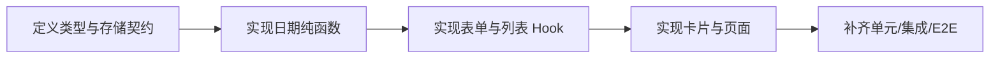

# 技术方案评审报告

## 1. 评审概述

- **项目名称**：纪念日 Daymark
- **评审日期**：2026-03-27
- **评审人**：Tech Lead Agent
- **评审文档**：
  - PRD：`.boss/daymark/prd.md`
  - 架构：`.boss/daymark/architecture.md`
  - UI：`.boss/daymark/ui-spec.md`

## 摘要

- **评审结论**：⚠️ 有条件通过
- **主要风险**：日期规则未完全定稿、MVP 范围被 UI 文档悄悄扩张、测试方案尚未满足质量门禁中的 E2E 要求
- **必须解决**：统一未来日期策略；统一是否包含备注字段与手动排序；补齐 E2E 测试计划并纳入任务拆解
- **建议优化**：为 `localStorage` 增加运行时结构校验；日期算法注入 `today` 以提高可测性；删除确认与 Toast 无障碍细节写入测试点
- **技术债务**：跨设备同步、提醒通知、农历支持全部延后，不在首版实现

---

## 2. 评审前判断（Linus 三问）

1. **这是真问题，不是臆想需求**：用户确实需要记录重要日子并快速得到“已过去多久”和“还要多久到下一次周年”的答案。
2. **有更简单的方法**：有，而且已经基本选对了。前端单页 + 本地存储就是最简解，不需要后端、账号系统、数据库。
3. **会破坏什么**：这是新仓库，没有历史兼容包袱；真正会破坏交付的是文档边界不一致，导致实现出的字段和行为互相打架。

---

## 3. 评审结论

| 维度 | 评分 | 说明 |
|------|------|------|
| 架构合理性 | ⭐⭐⭐⭐⭐ | 数据结构收敛，`AnniversaryRecord` 作为唯一持久化实体是正确方向。 |
| 技术选型 | ⭐⭐⭐⭐⭐ | `Vite + React + TypeScript + localStorage` 足够解决问题，没有过度设计。 |
| 可扩展性 | ⭐⭐⭐☆ | 已通过存储版本和纯函数隔离为后续演进留口，但产品边界仍需收紧。 |
| 可维护性 | ⭐⭐⭐⭐☆ | 分层明确，但 PRD / UI / 架构的字段不一致会直接损害可维护性。 |
| 安全性 | ⭐⭐⭐⭐☆ | 这是本地应用，安全面有限；主要风险在脏数据解析和危险操作确认。 |

**总体评价**：⚠️ 有条件通过。  
架构没问题，问题出在需求与设计边界还不够干净。先把阻塞项钉死，再开发，返工会少很多。

---

## 4. 技术风险评估

| 风险 | 等级 | 影响范围 | 缓解措施 |
|------|------|----------|----------|
| PRD、架构、UI 对未来日期策略不一致 | 高 | 日期校验、文案、测试、数据模型 | 先统一规则。建议 MVP 禁止未来日期，避免“已过去天数”和“尚未到来”双语义并存。 |
| UI 文档引入 `备注` 字段，超出 MVP 约定 | 高 | 表单、存储 schema、卡片布局、测试用例 | 首版删除备注字段；若坚持保留，必须同步更新 PRD、架构与验收标准。 |
| UI 文档引入手动排序切换，PRD 只要求默认排序 | 中 | 功能范围、交互复杂度、测试量 | MVP 先只做默认排序；手动排序降级为 V1.1。 |
| 质量门禁要求 E2E，但当前架构文档未纳入 | 高 | QA 门禁、交付可信度 | 将“新增、编辑、删除、刷新持久化”列为最小 E2E 流程并写入任务。 |
| 日期边界处理不严谨导致结果错误 | 高 | 核心业务可信度 | 所有日期计算通过纯函数统一处理；覆盖今天、跨年、闰年、2 月 29 日。 |
| `localStorage` 数据损坏后直接崩溃 | 中 | 启动稳定性、兼容演进 | 读取时做 JSON 解析保护和字段校验，异常回退为空仓库。 |
| 删除确认和 Toast 无障碍细节遗漏 | 中 | 键盘用户、屏幕阅读器用户 | 把焦点管理、`aria-live`、按钮可达性写入组件和 E2E 测试。 |

---

## 5. 技术可行性分析

### 5.1 核心功能可行性

| 功能 | 可行性 | 复杂度 | 说明 |
|------|--------|--------|------|
| 新增纪念日 | ✅ 可行 | S | 表单 + 本地存储，没有技术障碍。 |
| 展示已过去天数 | ✅ 可行 | S | 只要按日历日计算，不按毫秒差偷懒。 |
| 展示下一个周年倒计时 | ✅ 可行 | M | 关键在今天、跨年、2 月 29 日规则。 |
| 编辑 / 删除纪念日 | ✅ 可行 | S | 本质是替换和删除数组项，复杂度低。 |
| 默认排序 | ✅ 可行 | S | 视图层派生即可，不需要写回存储。 |
| 手动排序切换 | ✅ 可行但不建议首版做 | M | 会扩大 UI 状态和测试面，首版不值得。 |
| 备注字段 | ✅ 可行但不建议首版做 | M | 业务价值低于其引入的 schema 与布局成本。 |

### 5.2 技术难点

| 难点 | 解决方案 | 预估工时 |
|------|----------|----------|
| 日历日差与周年算法 | `normalize -> calculate -> format` 三层纯函数拆开，所有边界用单测锁死 | 0.5 天 |
| 本地存储读取容错 | 增加 schema 校验与版本化容器，解析失败回退空数组 | 0.25 天 |
| 无障碍删除确认与反馈 | 使用语义化表单、可聚焦按钮、模态焦点回收、`aria-live` Toast | 0.25 天 |
| E2E 覆盖核心闭环 | 编写新增、编辑、删除、刷新持久化四条流程 | 0.5 天 |

---

## 6. 架构改进建议

### 6.1 必须修改（阻塞项）

- [ ] **统一未来日期策略**：PRD 开放问题里倾向允许未来日期，但架构文档明确禁止未来日期。两者必须统一，否则表单校验、卡片文案、测试都无从落地。建议 MVP 直接禁止未来日期，保持“已过去天数”单一语义。
- [ ] **统一 MVP 字段范围**：UI 规范引入了 `备注` 字段，但 PRD 和架构的数据模型都没有。首版要么删掉备注，要么正式把它升级为需求并同步 schema。
- [ ] **统一排序能力范围**：PRD 只要求默认排序，UI 却设计了手动排序条。首版建议保留“默认按最近到来排序”，先删掉手动切换。
- [ ] **补齐 E2E 测试要求**：质量门禁明确要求 E2E；当前架构只写了单元和集成。没有 E2E，就不该说能过 QA 门禁。

### 6.2 建议优化（非阻塞）

- [ ] **`localStorage` 增加运行时校验**：不要只靠 TypeScript，自定义类型守卫就够，不需要引入重型校验库。
- [ ] **日期函数显式接收 `todayISO`**：测试时可稳定注入“今天”，避免测试依赖系统时钟。
- [ ] **删除确认优先使用原生对话框或轻量模态**：别上复杂弹窗库，问题不值得。
- [ ] **首页摘要区只显示最有价值的 2-3 个指标**：别把设计稿做成信息墓地。

---

## 7. 实施建议

### 7.1 开发顺序建议



### 7.2 里程碑建议

| 里程碑 | 内容 | 建议工时 | 风险等级 |
|--------|------|----------|----------|
| M1 | 类型、存储、日期算法和单元测试完成 | 0.5 天 | 中 |
| M2 | 表单、列表、编辑、删除、默认排序完成 | 0.5 天 | 中 |
| M3 | 无障碍细节、集成测试、E2E、构建验收完成 | 0.5 天 | 中 |

### 7.3 技术债务预警

| 潜在债务 | 产生原因 | 建议处理时机 |
|----------|----------|--------------|
| 跨设备同步 | MVP 不接后端 | 用户验证通过后再评估 |
| 提醒通知 | 首版聚焦记录与计算 | V1.1 或 V1.2 |
| 农历/重复规则扩展 | 当前数据模型只支持按年周年 | 明确真实需求后再设计 |

---

## 8. 代码规范建议

### 8.1 目录结构规范

```text
src/
├── app/                    # 页面壳与全局布局
├── features/anniversaries/ # 领域动作、视图派生、类型
├── lib/date/               # 纯函数算法
├── storage/                # 本地存储适配器
├── components/             # 纯 UI 组件
└── tests/                  # 单元 / 集成 / E2E
```

### 8.2 命名规范

- **文件命名**：工具函数用 `kebab-case`，React 组件用 `PascalCase`
- **组件命名**：围绕业务实体命名，如 `AnniversaryForm`、`AnniversaryCard`
- **函数命名**：动词开头，表达结果，如 `loadRecords`、`calculateMetrics`
- **变量命名**：原始数据叫 `record`，派生视图叫 `viewModel`，不要混用

### 8.3 代码风格

- 纯函数不读写浏览器对象
- UI 组件不直接读写 `localStorage`
- 不存任何可实时推导的衍生字段
- 超过 3 层缩进就重构数据流，不要堆条件分支

---

## 9. 质量门禁映射

| 门禁 | 当前状态 | 说明 |
|------|----------|------|
| Gate 0：类型 / Lint / 依赖 | ⚠️ 待实现验证 | 需要在脚手架落地后执行。 |
| Gate 1：单元 / 集成 / E2E / 覆盖率 | ❌ 当前未满足 | E2E 计划缺失，是当前最大门禁缺口。 |
| Gate 2：性能 | ⚠️ 理论可达成 | 静态单页做到 Lighthouse 80 不难，但仍需实际验证。 |

---

## 10. 最终评审结论

- **是否通过**：⚠️ 有条件通过
- **阻塞问题数**：4 个
- **建议优化数**：4 个
- **下一步行动**：先修正文档边界冲突，再由 Scrum Master 按“类型/算法/存储/UI/测试”拆任务；开发阶段必须把 E2E 纳入交付，不准口头补票。

---

**评审原则**：技术服务业务，但前提是边界清楚。当前方案的技术选型没有问题，真正该修的是需求和设计里的歧义。
