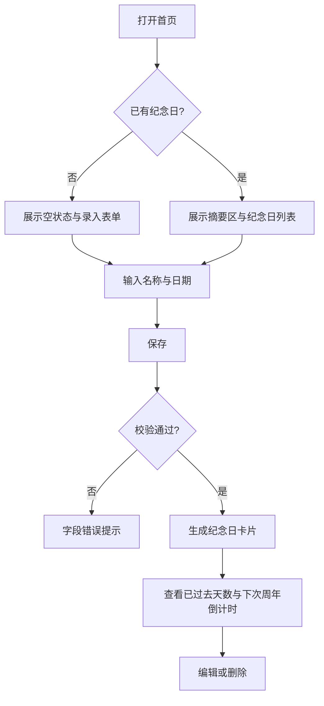

# UI/UX 规范文档

## 文档信息
- **功能名称**：daymark
- **版本**：1.0
- **创建日期**：2026-03-27
- **作者**：UI Designer Agent

## 摘要

- **设计风格**：温暖克制的纪念册界面，用浅暖底色、深墨文字和铜金强调色传达时间感。
- **主色调**：米白 `#F6F1E8`、墨灰 `#2C2621`、铜金 `#B77945`、松绿 `#5B7C67`。
- **核心组件**：顶部摘要区、纪念日录入表单、纪念日卡片、空状态插画区、错误提示条。
- **响应式断点**：移动端 `<768px` 单列；平板 `768-1024px` 双区块；桌面端 `>1024px` 左侧录入右侧列表。
- **设计系统**：自定义轻量设计令牌，不依赖重量级 UI 框架，保证视觉独特性与实现成本平衡。

---
---

## 1. 设计概述

### 1.1 设计理念
把“记录日期”做成一本可持续翻阅的时间册，而不是待办清单。视觉上避免高饱和、避免过度拟物，用纸张质感背景、时间轴线条和克制高亮来承载纪念感。

### 1.2 设计原则
- **简洁**：首页只保留录入、浏览、编辑三类高频操作，不引入多层导航。
- **一致**：所有状态都围绕“日期卡片”这一核心容器展开，避免同一信息在不同区域重复展示。
- **可访问**：重点指标不只靠颜色区分，必须配合文案、图标与结构层级表达。
- **响应式**：移动端优先保证单手可达，桌面端只做信息展开，不改变核心操作路径。

---

## 2. 用户流程

### 2.1 主流程



### 2.2 流程说明

| 步骤 | 页面/组件 | 用户行为 | 系统响应 |
|------|-----------|----------|----------|
| 1 | 首页 | 首次进入 | 根据是否有数据展示空状态或纪念日列表 |
| 2 | 录入表单 | 输入名称、日期 | 实时校验必填项、日期合法性与“不可晚于今天”的规则 |
| 3 | 保存按钮 | 点击保存 | 成功时新增卡片并滚动到新卡片；失败时保留输入并展示错误 |
| 4 | 纪念日卡片 | 浏览天数和倒计时 | 高亮最近到来的周年纪念日 |
| 5 | 卡片操作区 | 编辑、删除 | 编辑进入内联表单；删除弹出二次确认 |

---

## 3. 设计令牌

### 3.1 颜色系统

#### 主色调
| 名称 | 色值 | 用途 |
|------|------|------|
| Primary | `#B77945` | 主按钮、重点数字、激活状态 |
| Primary Light | `#D7A476` | 悬停高亮、渐变过渡 |
| Primary Dark | `#8E5930` | 按下态、强调边框 |

#### 语义色
| 名称 | 色值 | 用途 |
|------|------|------|
| Success | `#5B7C67` | 保存成功、正向提示 |
| Warning | `#D19A3C` | 即将到来的纪念日提示 |
| Error | `#B44C43` | 表单错误、危险操作 |
| Info | `#52718F` | 中性信息提示 |

#### 中性色
| 名称 | 色值 | 用途 |
|------|------|------|
| Paper | `#F6F1E8` | 页面背景 |
| Surface | `#FFFDFC` | 卡片背景 |
| Line | `#D8CFC1` | 边框、分割线 |
| Muted | `#8A7F74` | 辅助文字 |
| Text | `#2C2621` | 正文文字 |
| Title | `#171311` | 标题文字 |

### 3.2 排版系统

| 名称 | 大小 | 行高 | 字重 | 用途 |
|------|------|------|------|------|
| H1 | 32px | 1.15 | 700 | 首页主标题 |
| H2 | 24px | 1.25 | 650 | 区块标题 |
| H3 | 18px | 1.35 | 600 | 卡片标题 |
| Metric | 28px | 1.1 | 700 | 天数与倒计时数字 |
| Body | 16px | 1.6 | 400 | 正文 |
| Small | 14px | 1.5 | 400 | 辅助信息 |
| Caption | 12px | 1.4 | 500 | 标签、说明 |

**字体族**：
- 中文：`"Noto Serif SC", "Source Han Serif SC", "Microsoft YaHei", serif`
- 英文与数字：`"Fraunces", "Georgia", serif`
- 兜底：`system-ui`

### 3.3 间距系统

基础单位：4px

| 名称 | 值 | 用途 |
|------|-----|------|
| spacing-1 | 4px | 图标与文字紧凑距离 |
| spacing-2 | 8px | 表单内部小间距 |
| spacing-3 | 12px | 文案组内间距 |
| spacing-4 | 16px | 默认控件间距 |
| spacing-5 | 20px | 卡片内主要间距 |
| spacing-6 | 24px | 区块内边距 |
| spacing-8 | 32px | 模块间距 |
| spacing-10 | 40px | 页面主区块间距 |
| spacing-12 | 48px | 大屏留白 |

### 3.4 圆角

| 名称 | 值 | 用途 |
|------|-----|------|
| rounded-sm | 6px | 标签、提示条 |
| rounded-md | 10px | 输入框、按钮 |
| rounded-lg | 18px | 纪念日卡片 |
| rounded-xl | 24px | 摘要大卡与弹窗 |
| rounded-full | 9999px | 胶囊标签 |

### 3.5 阴影

| 名称 | 值 | 用途 |
|------|-----|------|
| shadow-sm | `0 4px 10px rgba(44,38,33,0.05)` | 输入区轻浮层 |
| shadow-md | `0 12px 24px rgba(44,38,33,0.08)` | 卡片默认阴影 |
| shadow-lg | `0 20px 40px rgba(44,38,33,0.12)` | 摘要区与弹窗 |

---

## 4. 页面规范

### 4.1 页面：首页

#### 布局结构
```
+------------------------------------------------------+
| 顶部摘要区：最近纪念日 / 总记录数 / 今日提示           |
+------------------------------------------------------+
| 录入表单卡片                                          |
+------------------------------------------------------+
| 列表说明条                                            |
+------------------------------------------------------+
| 纪念日卡片列表                                        |
|  - 卡片 1                                             |
|  - 卡片 2                                             |
|  - 卡片 3                                             |
+------------------------------------------------------+
```

#### 响应式断点
| 断点 | 宽度 | 布局调整 |
|------|------|----------|
| 移动端 | `< 768px` | 单列堆叠，摘要区改为纵向指标，表单按钮通栏 |
| 平板 | `768-1024px` | 摘要区 2 列，表单与列表上下布局 |
| 桌面 | `> 1024px` | 左侧固定录入区 360px，右侧列表自适应，多卡片双列 |

#### 组件清单
| 组件 | 位置 | 说明 |
|------|------|------|
| 顶部摘要区 | 页面顶部 | 展示最近周年、总条目、平均已纪念时长 |
| 录入表单 | 摘要区下方 | 新增或编辑纪念日 |
| 列表说明条 | 表单下方 | 固定说明列表按“距离下一次周年最近”排序 |
| 纪念日卡片 | 主内容区 | 展示单条纪念日的核心信息与操作 |
| Toast 区 | 页面底部浮层 | 反馈成功/错误消息 |

#### 首页信息架构
1. 第一屏先看到“最近要到来的纪念日”，让用户立刻感知产品价值。
2. 第二个重点是录入入口，减少首次使用阻力。
3. 列表区只呈现必要信息：名称、原始日期、已过去天数、距离下次周年、操作。
4. 次级信息只保留必要的原始日期与周年提示，不增加备注等次要字段。

---

## 5. 组件规范

### 5.1 录入表单

#### 字段组成
| 字段 | 类型 | 必填 | 说明 |
|------|------|------|------|
| 名称 | 单行输入 | 是 | 如“恋爱纪念日”“入职日” |
| 日期 | 日期选择器 | 是 | 统一使用本地日期，不带时区时分秒 |

#### 布局与交互
- 移动端：单列垂直布局，主按钮固定在表单底部。
- 桌面端：名称与日期并排，操作按钮与表单底部对齐。
- 编辑态与新增态复用同一表单，通过标题和按钮文案区分。

#### 状态
| 状态 | 边框颜色 | 背景 | 说明 |
|------|----------|------|------|
| Default | `Line` | `Surface` | 默认 |
| Focus | `Primary` | `#FFF8F2` | 聚焦时增加 2px 外发光 |
| Error | `Error` | `#FFF6F5` | 字段下展示明确错误文案 |
| Disabled | `#E7DED1` | `#F4EFE8` | 禁止输入 |

### 5.2 纪念日卡片

#### 卡片结构
```
+--------------------------------------------------+
| 名称                         [即将到来标签]       |
| 原始日期    已过去 xxx 天                         |
| 距离下一次周年还有 xx 天                          |
| [编辑] [删除]                     [周年日期提示]  |
+--------------------------------------------------+
```

#### 视觉要求
- 卡片左侧增加 3px 竖向时间线装饰色条，颜色随纪念日接近程度变化。
- “已过去天数”与“倒计时”采用 `Metric` 字级，数字使用衬线字体增强纪念感。
- 最近 30 天内即将到来的条目加浅铜金背景晕染，不使用刺眼红色。

#### 状态
| 状态 | 变化 |
|------|------|
| Default | `Surface` 背景，`shadow-md` |
| Hover | 阴影增强，整体上浮 2px |
| Active | 背景稍深，操作按钮显露 |
| Focus | 外圈 2px `Primary` 描边 |
| Highlight | 顶部增加“即将到来”胶囊标签 |

### 5.3 按钮 Button

#### 变体
| 变体 | 用途 | 样式 |
|------|------|------|
| Primary | 保存、确认 | 铜金实底，白字 |
| Secondary | 编辑、取消 | 纸白底 + 细描边 |
| Ghost | 次级说明或轻操作 | 无底，悬停出现浅底色 |
| Danger | 删除 | 浅红底，深红字 |

#### 尺寸
| 尺寸 | 高度 | 内边距 | 字号 |
|------|------|--------|------|
| Small | 32px | 10px 14px | 14px |
| Medium | 40px | 14px 18px | 16px |
| Large | 48px | 16px 22px | 16px |

#### 状态
| 状态 | 变化 |
|------|------|
| Default | 常规样式 |
| Hover | 背景提亮 6%，阴影增强 |
| Active | 缩放至 `0.98` |
| Disabled | 降低对比度与透明度，禁用事件 |
| Loading | 文案替换为旋转进度与“保存中” |

### 5.4 空状态

#### 结构
- 一张抽象月相或翻页日历插画
- 一句价值文案：“把重要的日子留下，时间会替你发声”
- 一个主按钮：“添加第一个纪念日”

#### 要求
- 空状态高度不超过一屏，避免空洞。
- 主按钮点击后自动聚焦到名称输入框。

### 5.5 错误状态

#### 形式
- 字段级错误：输入框下方 1 行红色说明
- 页面级错误：顶部内联提示条，不使用阻断式弹窗
- 删除确认：只有危险操作使用模态框

#### 文案原则
- 说清问题和改法，例如“日期不能为空”“名称最多 40 个字符”
- 不出现技术性报错词汇

---

## 6. 动效规范

### 6.1 过渡时长
| 名称 | 时长 | 用途 |
|------|------|------|
| fast | 140ms | 按钮、输入框反馈 |
| normal | 220ms | 卡片悬停、排序切换 |
| slow | 320ms | 列表新增、弹窗出现 |

### 6.2 缓动函数
| 名称 | 值 | 用途 |
|------|-----|------|
| ease-out | `cubic-bezier(0.22, 1, 0.36, 1)` | 元素进入 |
| ease-in-out | `cubic-bezier(0.4, 0, 0.2, 1)` | 常规状态切换 |
| spring-soft | `cubic-bezier(0.34, 1.56, 0.64, 1)` | 新卡片插入 |

### 6.3 关键动效
- 新增卡片：淡入 + 轻微上移 12px，时长 320ms。
- 倒计时高亮切换：数字颜色过渡，不做翻牌动画，避免廉价感。
- 输入错误：输入框轻微水平抖动 1 次，幅度不超过 4px。

---

## 7. 无障碍要求

### 7.1 对比度
- 正文文字与背景对比度不低于 `4.5:1`
- 指标数字与背景对比度不低于 `3:1`
- 重点标签必须同时用图标或文字区分，不只依赖底色

### 7.2 键盘导航
- 所有按钮、输入框、日期选择器支持 Tab 顺序访问
- 焦点顺序必须与视觉阅读顺序一致
- 删除确认弹窗打开后焦点锁定在弹窗内，关闭后回到触发按钮

### 7.3 屏幕阅读器
- 每张纪念日卡片作为一个语义分组，包含名称、原始日期、已过去天数、倒计时
- 图标按钮必须提供 `aria-label`，如“编辑恋爱纪念日”
- Toast 反馈区域使用 `aria-live="polite"`

---

## 变更记录

| 版本 | 日期 | 作者 | 变更内容 |
|------|------|------|----------|
| 1.0 | 2026-03-27 | UI Designer Agent | 初始化纪日 Daymark 的首页、表单、卡片、状态与响应式设计规范 |
